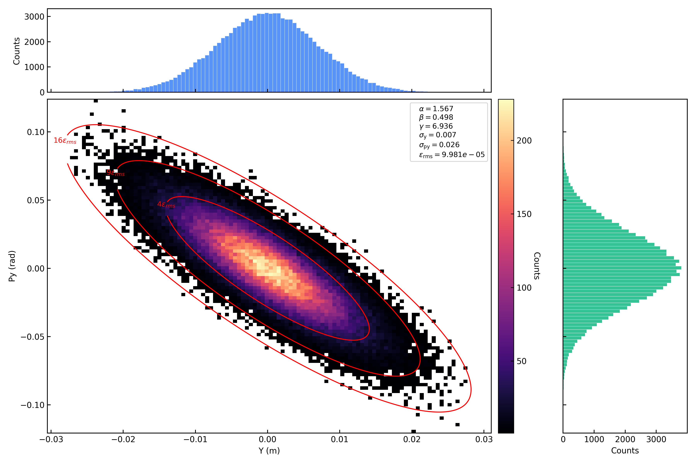
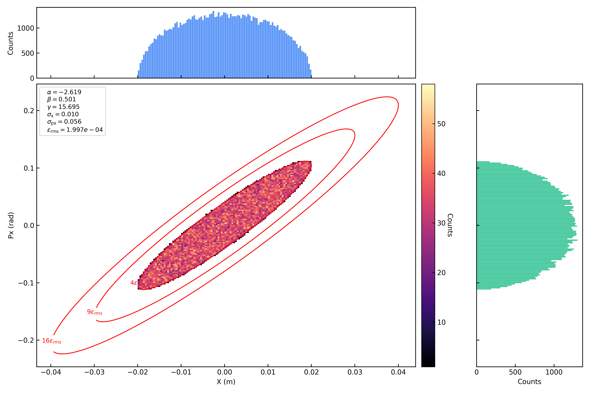
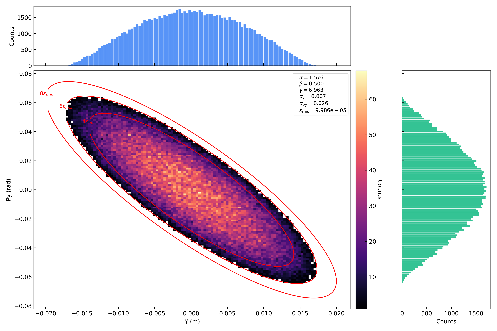
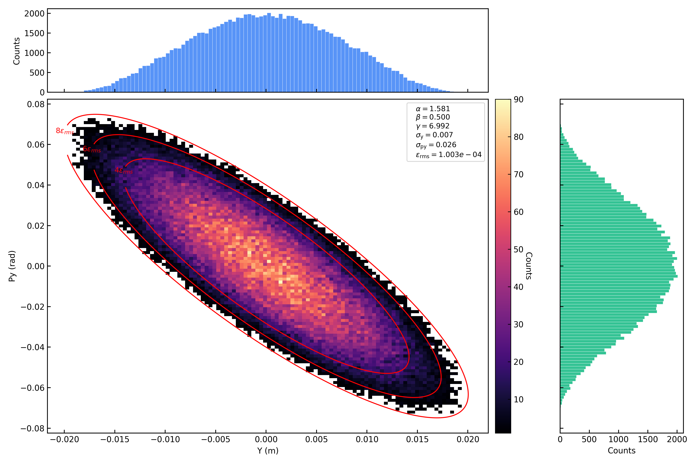
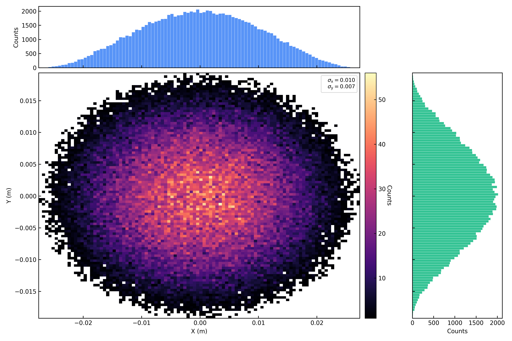
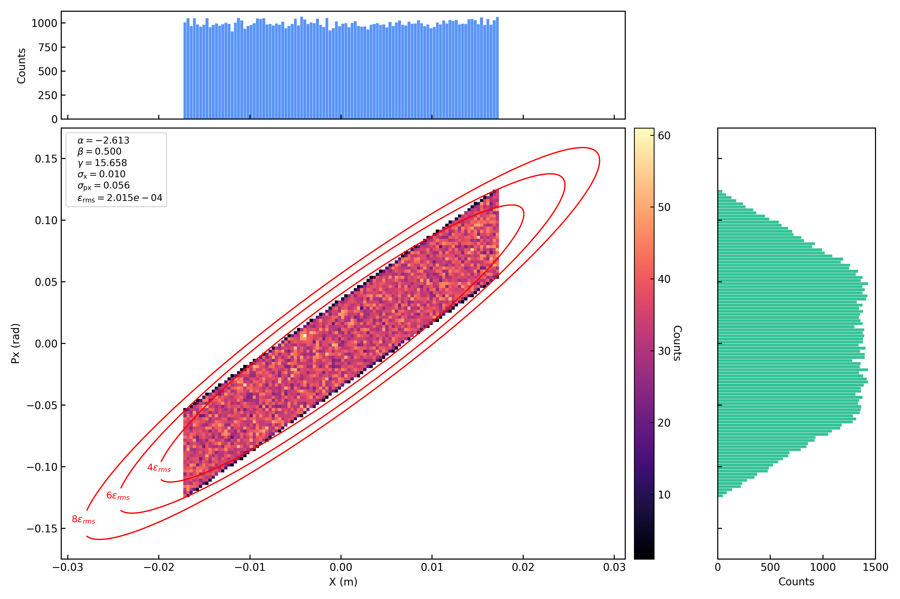
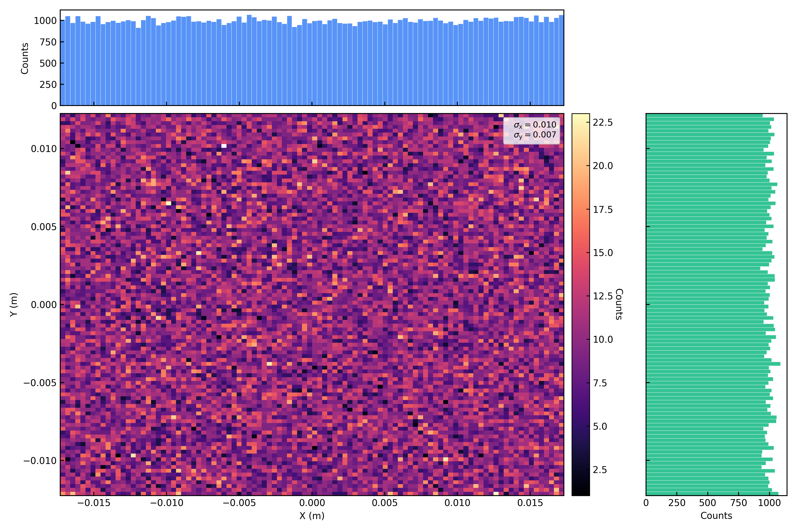
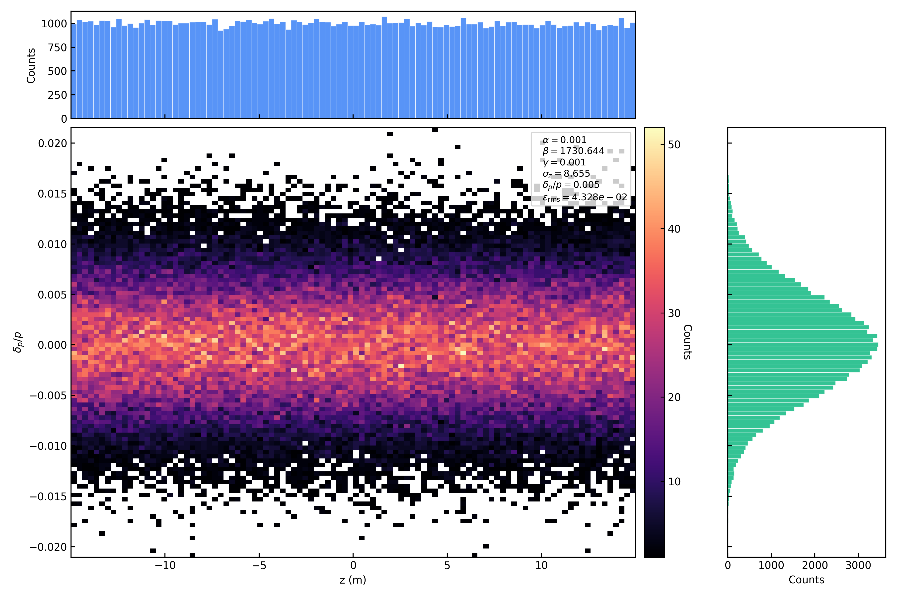

Injection / Particle Generation
===============================

This module introduces the **Injection** command in PASS, which is used to generate specific particle distributions at the simulation starting position and inject the beam. The injection command supports independently setting transverse distribution, longitudinal distribution, beam parameters, offsets, etc. for each bunch, and is the entry point for particle simulation.

Injection supports single-turn and multi-turn operation. The incoming distribution,
injection schedule and transverse offsets determine how each batch enters the ring;
time-dependent Bump magnets can vary its subsequent transverse motion.

**Code location**

- Source file: ``PASS/commands/injection.py``
- Class name: ``Injection`` (inherited from ``Command`` )
- Registration name: ``injection``
- Auxiliary class: ``InjectionBunchInfo`` (same file, responsible for parameter parsing and distribution generation of a single bunch)

.. _en-longitudinal-reference:

Longitudinal coordinate and reference time
------------------------------------------------

At a specified lattice location, ``bunch.t0`` is the actual passage time
:math:`T_b` of the ideal reference particle of bunch b. The stored, continuous
coordinate is a time difference expressed in metres:

.. math::

   z_i=\beta_b c(T_b-t_i),\qquad t_i=T_b-\frac{z_i}{\beta_b c}.

Positive z means earlier arrival. The reference particle is neither an
automatically recentered bunch centroid nor necessarily a stable RF synchronous
particle. No particle or bunch arrival-correction state is stored. All six
particle coordinates retain the configured storage precision; timing and RF
intermediates use float64. Local phase reduction never overwrites ``p.z``.

Reference transformations
~~~~~~~~~~~~~~~~~~~~~~~~~

A pure reference change at the same physical location preserves time and
mechanical momentum:

.. math::

   z_i'=\frac{\beta_b'}{\beta_b}z_i+\beta_b'c(T_b'-T_b),\qquad
   p_{x,y}'=p_{x,y}\frac{P_{0,b}}{P_{0,b}'},\qquad
   \delta_i'=\frac{P_{0,b}(1+\delta_i)}{P_{0,b}'}-1.

Injection and regrouping apply the required coordinate conversions locally;
``PASS/core/bunch.py`` updates the reference energy parameters. For a zero-length
RF energy kick, :math:`T_b'=T_b`, so z scales by the reference velocity ratio.
The particle energy also receives the physical RF kick; this is distinct from
the pure normalization transformation. See :doc:`element/rfcavity`.

Transport advances the reference event by its reference flight time. In an
exact straight drift of length L, :math:`\Delta T_b=L/(\beta_b c)` and
:math:`\Delta t_i=LE_i/(cP_{s,i})`. Other transfer maps retain their documented
approximations. The time-coordinate migration does not change normalized
quadrupole strengths or magnetic maps.

Fixed macro-particle weights
----------------------------

All populated bunches within one beam must use the same represented real-particle
count per macro particle, given by ``Number of Real Particles / Number of Macro
Particles`` in the initial input. Different input weights are rejected. This
fixed value applies to every planned injection batch. Injection
activates reserved particles; it does not rescale their weights according to
the current population, losses, or destination bunch.

Sorting and regrouping retain this scalar weight, including in empty groups.
No per-particle weight or wake-charge array is allocated. Rounded diagnostic
real-particle counts never feed back into the weight. Slicer, SpaceCharge and
WakeField use the same fixed ``bunch.ratio``; only particles with ``tag > 0``
contribute. Injection and losses change the active population, never the
weight of the remaining particles.

Reference-momentum precision
----------------------------

The incoming momentum deviation is converted to the circulating reference as

.. math::

  \delta_{\mathrm{circ}} =
  \frac{p_{0,\mathrm{inj}}}{p_{0,\mathrm{circ}}}\delta_{\mathrm{inj}}
  + \frac{p_{0,\mathrm{inj}}-p_{0,\mathrm{circ}}}{p_{0,\mathrm{circ}}}.

This form avoids subtracting nearly equal unit-sized values. The shared CPU/GPU
injection path evaluates the conversion in FP64 before storing the result in the
configured particle precision. Equal reference momenta preserve the incoming
``dp`` values exactly, including small FP32 deviations. All six particle arrays
retain their common configured FP32 or FP64 dtype.

Interface parameters
--------------------

The parameters of the ``Injection`` command are shown in the table below. Here ``s`` must be 0 (the injection point is fixed at the starting position of the sequence), ``name`` is automatically filled by the sequence key name, and ``bunch0`` , ``bunch1`` , ... are the parameter dictionaries of each bunch.

.. list-table::
  :header-rows: 1
  :widths: 20 25 10 10 35

  * - Property
    - JSON key
    - Type
    - Unit
    - Description
  * - ``s``
    - ``S (m)``
    - float
    - m
    - Injection position (must be 0)
  * - ``name``
    - ``name``
    - str
    - -
    - Element name, automatically filled by the sequence key name
  * - ``harmonic_number``
    - ``Harmonic Number``
    - int
    - -
    - Bunch-grouping count; declare the same number of ``bunch0``, ``bunch1``, ... dictionaries and use empty bunches for unfilled groups
  * - ``random_seed``
    - ``Random Seed``
    - int or null
    - -
    - Optional seed for particle-distribution generation. Omit it, or set it to ``null``, for a non-deterministic seed; a supplied value, including 0, makes the generated distribution reproducible for the same input and execution order
  * - ``bunch0``
    - ``bunch0``
    - dict
    - -
    - Parameter dictionary of the 0th bunch
  * - ``bunch1``
    - ``bunch1``
    - dict
    - -
    - Parameter dictionary of the 1st bunch
  * - ...
    - ...
    - dict
    - -
    - Parameter dictionaries of more bunches

Bunch parameters
----------------

Each bunch uses ``bunch0`` , ``bunch1`` , ... as keys, and the value is a dictionary containing all parameters of that bunch. The parameters are described below in five groups: transverse, longitudinal, beam, distribution, and offset.

Transverse parameters
~~~~~~~~~~~~~~~~~~~~~

.. list-table::
  :header-rows: 1
  :widths: 20 35 10 10 25

  * - Property
    - JSON key
    - Type
    - Unit
    - Description
  * - ``alphax``
    - ``Alpha x``
    - float
    - -
    - Horizontal Twiss parameter :math:`\alpha_x`
  * - ``alphay``
    - ``Alpha y``
    - float
    - -
    - Vertical Twiss parameter :math:`\alpha_y`
  * - ``betax``
    - ``Beta x (m)``
    - float
    - m
    - Horizontal Twiss parameter :math:`\beta_x`
  * - ``betay``
    - ``Beta y (m)``
    - float
    - m
    - Vertical Twiss parameter :math:`\beta_y`
  * - ``emitx``
    - ``Emittance x (m'rad)``
    - float
    - m·rad
    - Horizontal emittance :math:`\varepsilon_x`
  * - ``emity``
    - ``Emittance y (m'rad)``
    - float
    - m·rad
    - Vertical emittance :math:`\varepsilon_y`
  * - ``dx``
    - ``Dx (m)``
    - float
    - m
    - Horizontal dispersion function :math:`D_x`
  * - ``dpx``
    - ``Dpx``
    - float
    - -
    - Horizontal dispersion derivative :math:`D_{px}`
  * - ``dist_trans``
    - ``Transverse dist``
    - str
    - -
    - Transverse distribution type, options: ``gaussian`` , ``kv`` , ``waterbag`` , ``parabolic`` , ``uniform``

Longitudinal parameters
~~~~~~~~~~~~~~~~~~~~~~~

.. list-table::
  :header-rows: 1
  :widths: 20 45 10 10 15

  * - Property
    - JSON key
    - Type
    - Unit
    - Description
  * - ``sigmaz``
    - ``Sigma z (m)``
    - float
    - m
    - Longitudinal bunch length RMS value :math:`\sigma_z`
  * - ``dp``
    - ``Sigma dp/p``
    - float
    - -
    - Momentum spread RMS value :math:`\sigma_{\delta}`
  * - ``dist_longi``
    - ``Longitudinal dist``
    - str
    - -
    - Longitudinal distribution type, options: ``gaussian`` , ``coasting`` , ``matchz`` , ``matchdp``
  * - ``rf_voltage``
    - ``RF Voltage (V)``
    - float
    - V
    - RF voltage (required for ``matchz`` and ``matchdp`` distributions)
  * - ``rf_phi``
    - ``RF Phase (rad)``
    - float
    - rad
    - RF phase :math:`\phi_s` (required for ``matchz`` and ``matchdp`` distributions)
  * - ``harmonic_num``
    - Injection-level ``Harmonic Number``
    - int
    - -
    - Bunch-grouping count :math:`h_{\mathrm{group}}` passed down from the Injection level. It is also used by ``matchz`` / ``matchdp`` to set the longitudinal scale, but does not constrain the RFCavity harmonic
  * - ``harmonic_id``
    - ``Harmonic ID of this bunch``
    - int
    - -
    - Bunch-group index :math:`h_{\mathrm{id}}`, defining the fixed center :math:`z_{\mathrm{center}}=h_{\mathrm{id}}C/h_{\mathrm{group}}`
  * - ``rf_position``
    - ``RF S Position Refer to Inj. Point (m)``
    - float
    - m
    - Longitudinal position of the RF cavity relative to the injection point, used to back-propagate the distribution generated at s\_rf to the injection point s=0
  * - ``ddp``
    - ``Momentum Offset dp``
    - float
    - -
    - Bunch-level average momentum deviation :math:`\delta_0` , added to each particle's dp. Mutually exclusive with ``dde``
  * - ``dde``
    - ``Kinetic Energy Offset (eV)``
    - float
    - eV
    - Bunch-level kinetic energy offset, internally converted to ``ddp`` . Mutually exclusive with ``ddp``

Beam parameters
~~~~~~~~~~~~~~~

.. list-table::
  :header-rows: 1
  :widths: 25 45 10 10 10

  * - Property
    - JSON key
    - Type
    - Unit
    - Description
  * - ``Ek``
    - ``Kinetic Energy per Nucleon (eV/u)``
    - float
    - eV/u
    - Kinetic energy per nucleon
  * - -
    - ``Number of Real Particles``
    - int
    - -
    - Planned total number of real particles over all injection events for this bunch
  * - -
    - ``Number of Macro Particles``
    - int
    - -
    - Planned total number of macro particles over all injection events for this bunch
  * - ``stop_turn``
    - ``Total Injection Turns``
    - int
    - -
    - Exclusive stop turn, counted from turn 0; positive integer, default 1
  * - ``interval``
    - ``Injection Interval``
    - int
    - -
    - Injection interval in turns; positive integer, default 1

Distribution parameters
~~~~~~~~~~~~~~~~~~~~~~~

.. list-table::
  :header-rows: 1
  :widths: 25 45 10 20

  * - Property
    - JSON key
    - Type
    - Description
  * - ``is_load_dist``
    - ``Is Load Distribution from File``
    - bool
    - Whether to load particle distribution from file
  * - ``load_dist_filepath``
    - ``Distribution File Path``
    - str
    - Distribution file path ( ``.tfs`` format)
  * - ``load_dist_mode``
    - ``Distribution File Mode``
    - str
    - ``sequential`` (default) reads successive rows for each bunch; ``repeat`` reads from the beginning at each injection event
  * - ``is_save_init_dist``
    - ``Is Save Initial Distribution``
    - bool
    - Whether to save the initial distribution
  * - ``insert_particles``
    - ``Insert Particle Coordinate``
    - list
    - Replace the first rows of the first batch after offsets are applied, using ``[[x, px, y, py, z, dp], ...]``; these rows are included in the planned particle count

Offset parameters
~~~~~~~~~~~~~~~~~

The horizontal offset ( ``Offset x`` ) and vertical offset ( ``Offset y`` ) have the same structure, each containing the following sub-parameters:

.. list-table::
  :header-rows: 1
  :widths: 25 30 10 35

  * - Property
    - JSON key
    - Type
    - Description
  * - ``is_offset``
    - ``Is Offset``
    - bool
    - Whether to enable offset
  * - ``is_offset_fromfile``
    - ``Is Load From File``
    - bool
    - Whether to load offset data from file
  * - -
    - ``File Path``
    - str
    - Offset data file path ( ``.tfs`` format)
  * - -
    - ``File Time Kind``
    - str
    - Time column type, options: ``turn`` , ``time``
  * - ``offset_position``
    - ``Offset Position (m)``
    - float
    - Position offset
  * - ``offset_momentum``
    - ``Offset Momentum (rad)``
    - float
    - Momentum offset

.. _en-multiturn-injection:

Multi-turn injection and transverse painting
--------------------------------------------

Injection schedule and particle population
~~~~~~~~~~~~~~~~~~~~~~~~~~~~~~~~~~~~~~~~~~

Each bunch has its own injection schedule. Let ``Total Injection Turns`` be
:math:`T` and ``Injection Interval`` be :math:`\Delta n`. Injection occurs at

.. math::

   n_k=k\Delta n<T,\qquad
   k=0,\ldots,N_{\mathrm{event}}-1,\qquad
   N_{\mathrm{event}}=\left\lceil\frac{T}{\Delta n}\right\rceil.

The stop turn is excluded. ``Number of Macro Particles`` gives the planned
total :math:`N` for the bunch. Each event receives
:math:`\lfloor N/N_{\mathrm{event}}\rfloor` particles; the first event also
receives the remainder. Events assigned zero particles add no population.
The simulation must run through every event assigned particles to inject the
full population. For a nonempty source with ``Is Save Initial Distribution``
enabled, the distribution is saved at the last scheduled event, even when that
event adds zero particles. After all particles are injected and all requested
saves have succeeded, subsequent Injection calls return immediately without
searching the event schedules or recording additional turn numbers.

Reserved particles have ``tag=0`` and contribute neither tracking nor charge
deposition, statistics or losses. Injection activates only the current batch.
Live particles have ``tag>0``; lost particles have ``tag<0`` and retain their
loss coordinates. The identity ``abs(tag)`` of an injected particle remains
unchanged by sorting or loss. The fixed macro-particle weight defined above
applies throughout injection and storage.

An injection batch identifies when particles enter the ring. Longitudinal bunch
groups are specified separately by ``Harmonic Number`` and
``Harmonic ID of this bunch``. Completing injection ends particle loading;
circulating particles continue to follow the lattice and any active waveforms.

Incoming distribution and offsets
~~~~~~~~~~~~~~~~~~~~~~~~~~~~~~~~~

With ``Is Load Distribution from File=true``, each bunch reads its own TFS file
with columns ``x``, ``px``, ``y``, ``py``, ``z`` and ``dp``. Positions are in metres;
momenta use the specified injection reference momentum. ``Distribution File Mode``
controls row selection:

* ``sequential`` consumes consecutive rows across events. The file must contain
  at least the planned total number of particles for that bunch.
* ``repeat`` starts at row zero at each event, taking that event's particle count.
  The file must contain at least the largest batch. Reusing source coordinates
  still creates new particles with distinct identities.

Otherwise, Injection generates the selected transverse and longitudinal
distributions for each batch. Generated and loaded particles both receive the
configured horizontal dispersion and ``Offset x`` / ``Offset y``. The offsets
apply only at injection. A file-based offset is linearly interpolated at the
injection turn or incoming reference passage time, according to its ``turn`` or
``time (s)`` column. The position and momentum columns are ``x (m)`` / ``px (rad)``
or ``y (m)`` / ``py (rad)``. Nodes must increase strictly, values must be finite,
and the table must cover every requested injection event.

``Insert Particle Coordinate`` replaces the first rows of the first batch after
these offsets, before conversion to the circulating reference. The batch must
contain enough rows for these explicitly specified particles. Missing input rows,
non-finite coordinates, or nonpositive longitudinal momentum cause an error before
the affected batch is activated.

The incoming physical momentum remains determined by the specified injection
energy even when the circulating beam has accelerated. Injection converts the
incoming momenta and longitudinal coordinate to the destination bunch reference
while preserving physical momentum and arrival time, as defined in
:ref:`en-longitudinal-reference`.

Transverse painting with Bump magnets
~~~~~~~~~~~~~~~~~~~~~~~~~~~~~~~~~~~~~

Painting fills transverse phase space over successive injection events by
varying the incoming beam position and momentum, the circulating orbit, or both.
``Offset x`` and ``Offset y`` prescribe the incoming beam coordinates at the
injection point. :doc:`element/bump` supplies horizontal and vertical pulsed
magnetic kicks along the circulating lattice. Every live particle passing a
Bump receives its kick, including particles from earlier batches.

Incoming coordinates and Bump transport use the same fixed machine coordinates.
Specify the incoming centroid at the injection plane and the physical magnet
waveforms separately; an orbit displacement is not itself a magnet kick.
In particle-time mode, the waveform is sampled at
:math:`t_i=t_0-z_i/(\beta_0c)` plus the configured ``Time offset (s)``. The table
must cover the arrival times of the particles being deflected. The Bump page
defines reference-time sampling, interpolation and pulse-boundary behavior.

Injection creates or loads particles at the injection plane and applies the
specified offsets. Lattice elements perform subsequent transport and loss
checks. In particular, :doc:`element/elseparator` evaluates electric deflection
and electrode or vacuum-wall contact when particles pass through that element.
Particles specified at the ES exit begin tracking at that plane; Injection
does not apply an additional geometric acceptance cut.

Observing injection
~~~~~~~~~~~~~~~~~~~

Place :doc:`monitor/distmonitor` at the desired observation plane and turn to
save the injected population. At :math:`s=0`, Injection executes before the
monitor, so the snapshot includes the current batch. Enable
``Include injection metadata`` to save ``particle_id``, ``injection_turn`` and
``injection_batch``. Turn and batch indices start at zero; each source bunch
has its own batch index, so use ``particle_id`` for particle matching.

Both ``Output format=tfs`` and ``Output format=hdf5`` exclude pending slots,
retain lost particles and report ``NumPending``. Select ``tag>0`` when examining
the live phase-space distribution at the monitor. Coordinates of lost particles
refer to their loss locations. Use :doc:`monitor/statmonitor` for the evolution
of the circulating population and its statistical moments.

Introduction to particle distribution types
-------------------------------------------

In the PASS program, the initial particle distribution is implemented by the **Injection** command. In the **Injection** command, different distribution information can be set independently for each bunch.

Transverse particle distribution
--------------------------------

Currently, the PASS program supports generating the following transverse particle distributions: **horizontally-vertically decoupled 2D Gaussian distribution** , **4D KV distribution** , **4D waterbag distribution** , **4D parabolic distribution** , **2D uniform distribution in phase space** .

The 4D distribution refers to defining a generalized hyper-ellipsoid boundary in the 4D phase space :math:`(x, p_x, y, p_y)`. To simplify the derivation without loss of generality, we introduce **normalized coordinates** :

.. math::

  X = \frac{x}{a}, \quad P_x = \frac{p_x}{b}, \quad Y = \frac{y}{c}, \quad P_y = \frac{p_y}{d}

where :math:`a, b, c, d` are the **maximum physical envelope boundaries (hard boundaries)** of the beam in the corresponding dimensions. Under this normalized coordinate system, the 4D hyper-ellipsoid boundary simplifies to a unit hypersphere:

.. math::

  r^2 = X^2 + P_x^2 + Y^2 + P_y^2 \le 1

The following describes each transverse particle distribution in detail. For 4D distributions, their projections onto the 1D plane have a unified power-law form. Let the distribution density in 4D phase space be :math:`f(r^2) \propto (1-r^2)^{\alpha}` (`\alpha \ge 0`, defined within the 4D unit ball :math:`B^4`), then the 1D marginal distribution for any single normalized coordinate :math:`u` is:

.. math::

  \rho(u) \propto (1-u^2)^{\frac{n-1}{2}+\alpha}, \quad |u| \le 1

where :math:`n=4` is the phase space dimension. For distributions uniformly distributed on the :math:`n`-dimensional sphere :math:`S^{n-1}` (such as KV), the 1D projection is:

.. math::

  \rho(u) \propto (1-u^2)^{\frac{n-3}{2}}

The 1D projections of each distribution are summarized below:

.. list-table::
  :header-rows: 1
  :widths: 25 20 15 15 25

  * - Distribution
    - 4D density
    - :math:`\alpha`
    - 1D projection power
    - 1D projection form
  * - Uniform (2D square)
    - —
    - —
    - 0
    - :math:`\rho(u) = \mathrm{const}`
  * - KV ( :math:`S^3` sphere)
    - :math:`\delta(r-1)`
    - —
    - :math:`\frac{1}{2}`
    - :math:`\rho(u) \propto \sqrt{1-u^2}`
  * - Waterbag ( :math:`B^4` uniform)
    - :math:`1`
    - 0
    - :math:`\frac{3}{2}`
    - :math:`\rho(u) \propto (1-u^2)^{3/2}`
  * - Parabolic ( :math:`B^4` , :math:`1-r^2` )
    - :math:`(1-r^2)^1`
    - 1
    - :math:`\frac{5}{2}`
    - :math:`\rho(u) \propto (1-u^2)^{5/2}`

The following describes each transverse particle distribution in detail:

  - **Independent 2D Gaussian distribution (Gaussian)**

    In the :math:`x-p_x` and :math:`y-p_y` phase spaces, transverse coordinates following a Gaussian distribution are generated independently. The particle distribution in transverse phase space uses a :math:`4\sigma` truncation, i.e., only particles satisfying:

    .. math::

       |x| \le 4\sigma_x, \quad |y| \le 4\sigma_y

    are retained.

    For the 2D phase space Gaussian distribution ( :math:`x-p_x` and :math:`y-p_y` ), the particle inclusion ratios corresponding to different RMS emittances are as follows:

    +------------------------------------------+------------------------+-----------------+
    | :math:`\epsilon/\epsilon_{\mathrm{rms}}` | Truncation range       | Retained ratio  |
    +==========================================+========================+=================+
    | 1                                        | :math:`1\sigma`        | 39.346934029%   |
    +------------------------------------------+------------------------+-----------------+
    | 2                                        | :math:`\sqrt{2}\sigma` | 63.212055883%   |
    +------------------------------------------+------------------------+-----------------+
    | 4                                        | :math:`2\sigma`        | 86.466471676%   |
    +------------------------------------------+------------------------+-----------------+
    | 6                                        | :math:`\sqrt{6}\sigma` | 95.021293163%   |
    +------------------------------------------+------------------------+-----------------+
    | 9                                        | :math:`3\sigma`        | 98.889100346%   |
    +------------------------------------------+------------------------+-----------------+
    | 16                                       | :math:`4\sigma`        | 99.966453737%   |
    +------------------------------------------+------------------------+-----------------+

    Therefore, under the :math:`4\sigma` truncation condition, the particle loss ratio is very low (approximately :math:`3.3\times10^{-4}` ), and the Gaussian tail can be considered fully covered.

    The specific truncation ratio can be calculated using the following function:

    .. code-block:: python

        import numpy as np

        def fraction_by_emittance(epsilon, epsilon_rms):
            fraction = 1 - np.exp(-epsilon / (2 * epsilon_rms))
            print(f"eps/eps_rms = {epsilon/epsilon_rms}, particle proportion = {fraction:.9%}")

        for epsi in (1, 2, 4, 6, 8, 9, 16, 25, 36):
            fraction_by_emittance(epsilon=epsi, epsilon_rms=1)

  - **4D KV (Kapchinskij-Vladimirskij) distribution**

    In the :math:`x-p_x-y-p_y` four-dimensional phase space, a particle distribution **uniformly distributed on the surface of a four-dimensional hyper-ellipsoid** is generated, which is an idealized distribution existing only on the 4D spherical shell. Under this distribution, the space charge field produced by the particles is strictly linear within the bunch, enabling a rigorous analytical solution of the space charge problem.

    After integrating out two dimensions, the projection of the KV distribution onto any 2D plane (such as the :math:`x-p_x` plane) is a uniformly filled ellipse. After further integrating out one dimension, the projection of the KV distribution onto the 1D plane is a semi-ellipse (or semi-circle) distribution. The detailed derivation is as follows: the KV distribution is uniformly distributed on the 4D hypersphere :math:`S^3` ( :math:`r^2 = 1` ). To obtain the 1D marginal distribution of :math:`u_x`, the remaining three coordinates on :math:`S^3` need to be integrated:

    .. math::

       \rho(u_x) \propto (1-u_x^2)^{\frac{n-3}{2}} = (1-u_x^2)^{\frac{1}{2}}

    i.e., the 1D projection power is :math:`\frac{1}{2}` .

    .. note::

      According to the integration: in the :math:`x-p_x` and :math:`y-p_y` phase planes, the full emittance of the KV distribution is 4 times the RMS emittance.

    i.e., all particles in the KV distribution are within the :math:`2\sigma` truncation range. However, the program still retains particles satisfying:

    .. math::

       |x| \le 4\sigma_x, \quad |y| \le 4\sigma_y

  - **4D Waterbag distribution**

    In the :math:`x-p_x-y-p_y` four-dimensional phase space, a particle distribution **uniformly distributed inside the four-dimensional hyper-ellipsoid** is generated.

    After integrating out two dimensions, the projection of the waterbag distribution onto any 2D plane (such as the :math:`x-p_x` plane) follows a parabolic distribution. After further integrating out one dimension, the projection of the waterbag distribution onto the 1D plane is a :math:`\frac{3}{2}` -power parabolic distribution. The detailed derivation is as follows: the waterbag distribution is uniformly distributed inside the 4D hyper-ball :math:`B^4` ( :math:`f(r^2) = 1` , i.e., :math:`\alpha = 0` ). To obtain the 1D marginal distribution of :math:`u_x`, the remaining three coordinates on :math:`B^4` need to be integrated, and the remaining part is a 3D ball of radius :math:`\sqrt{1-u_x^2}` :

    .. math::

       \rho(u_x) \propto V_3\!\left(\sqrt{1-u_x^2}\right) \propto (1-u_x^2)^{\frac{3}{2}}

    where :math:`V_3(R) \propto R^3` is the 3D ball volume. i.e., the 1D projection power is :math:`\frac{3}{2}` .

    .. note::

      According to the integration: in the :math:`x-p_x` and :math:`y-p_y` phase planes, the full emittance of the waterbag distribution is 6 times the RMS emittance.

    i.e., all particles in the waterbag distribution are within the :math:`\sqrt{6}\sigma` truncation range. However, the program still retains particles satisfying:

    .. math::

       |x| \le 4\sigma_x, \quad |y| \le 4\sigma_y

  - **4D Parabolic distribution**

    In the :math:`x-p_x-y-p_y` four-dimensional phase space, a particle distribution with **density decreasing parabolically from the center outward as r increases** is generated. This distribution is more realistic than the waterbag distribution for beams in real accelerators that tend to be concentrated toward the center.

    After integrating out two dimensions, the projection of the parabolic distribution onto any 2D plane (such as the :math:`x-p_x` plane) follows a quadratic parabolic distribution. After further integrating out one dimension, the projection of the parabolic distribution onto the 1D plane is a :math:`\frac{5}{2}` -power parabolic distribution. The detailed derivation is as follows: the 4D density of the parabolic distribution is :math:`f(r^2) \propto (1-r^2)^1` ( :math:`\alpha = 1` ). To obtain the 1D marginal distribution of :math:`u_x`:

    .. math::

       \rho(u_x) \propto (1-u_x^2)^{\frac{n-1}{2}+\alpha} = (1-u_x^2)^{\frac{3}{2}+1} = (1-u_x^2)^{\frac{5}{2}}

    i.e., the 1D projection power is :math:`\frac{5}{2}` .

    .. note::

      According to the integration: in the :math:`x-p_x` and :math:`y-p_y` phase planes, the full emittance of the parabolic distribution is 8 times the RMS emittance.

    i.e., all particles in the parabolic distribution are within the :math:`\sqrt{8}\sigma` truncation range. However, the program still retains particles satisfying:

    .. math::

       |x| \le 4\sigma_x, \quad |y| \le 4\sigma_y

  - **Uniform distribution**

    In the :math:`x-p_x` and :math:`y-p_y` phase spaces, 2D uniform square distributions are generated independently. For each transverse plane, uniform sampling is performed within the square region :math:`[-1, 1] \times [-1, 1]` in normalized coordinates :math:`(u, v)` , and then mapped to physical coordinates through Twiss parameters. The RMS emittance of this distribution is strictly equal to the input parameter :math:`\varepsilon` , the full emittance is 3 times the RMS emittance, and all particles are within the :math:`\sqrt{3}\sigma` truncation range. This distribution can simulate the initial beam produced by an electron gun, etc.

    After integrating out one dimension, the projection of the uniform distribution onto the 1D plane is a constant (uniform) distribution. Since :math:`u_x` and :math:`v_x` are independently and uniformly distributed on :math:`[-1, 1]` , after integrating over :math:`v_x`:

    .. math::

       \rho(u_x) = \frac{1}{2} = \mathrm{const} \propto (1-u_x^2)^{0}

    i.e., the 1D projection power is :math:`0` .

Longitudinal particle distribution
----------------------------------

Currently, the PASS program supports generating the following longitudinal particle distributions: **2D Gaussian distribution** , **coasting beam distribution** , **distribution matched to RF parameters - longitudinal bunch length RMS value** , **distribution matched to RF parameters - momentum spread RMS value** :

  - **2D Gaussian distribution (Gaussian)**

    In the :math:`z-p_z` phase space, longitudinal coordinates following a Gaussian distribution are generated. The particle distribution in longitudinal phase space uses a :math:`4\sigma` truncation, i.e., only particles satisfying:

    .. math::

      |z| \le 4\sigma_z

    are retained.

  - **Coasting beam distribution (Coasting)**

    In the :math:`z-p_z` phase space, longitudinal coordinates are generated where :math:`z` follows a uniform distribution and :math:`p_z` follows a Gaussian distribution. The particles are not truncated in the longitudinal phase space; the longitudinal position coordinate has a maximum of half the circumference and a minimum of negative half the circumference.

  - **Distribution matched to RF parameters - longitudinal bunch length RMS value (MatchZ)**

    In the :math:`z-p_z` phase space, longitudinal coordinates satisfying both the RF parameters and the longitudinal bunch length constraint ( :math:`\sigma_z` ) are generated. The particle distribution in longitudinal phase space uses a :math:`2\sigma` truncation, i.e., only particles satisfying:

    .. math::

       |z| \le 2\sigma_z

    are retained.

  - **Distribution matched to RF parameters - momentum spread RMS value (MatchDp)**

    In the :math:`z-p_z` phase space, longitudinal coordinates satisfying both the RF parameters and the momentum spread constraint ( :math:`\sigma_{\delta}` ) are generated. The particle distribution in longitudinal phase space uses a :math:`2\sigma` truncation, i.e., only particles satisfying:

    .. math::

       |z| \le 2\sigma_z

    are retained.

Multi-bunch Longitudinal Coordinates
~~~~~~~~~~~~~~~~~~~~~~~~~~~~~~~~~~~~

The source distribution uses :math:`z_s=\beta_s c(T_s-t_i)`. The prescribed
machine clock, injection turn and slot select its reference event; an explicit
initial time is also supported, as described in :ref:`en-reference-clock`.
Before writing to the destination bunch, PASS transforms

.. math::

   z_d=\frac{\beta_d}{\beta_s}z_s+\beta_d c(T_d-T_s).

Mechanical momenta are rebased at the same time. Physical time and momentum
are preserved; z is never folded. RF samples :math:`T_d-z_d/(\beta_d c)` directly.

The nominal slot position is computed as ``harmonic_id*C/harmonic_number``
when writing logs or output; no ``bunch.z_center`` attribute is stored.
Existing ``ZCenter``/``zCenter`` output fields retain this derived metadata.
The diagrams below use ``z_center`` for the same nominal position. This is
distinct from ``slice_table['z_center']``, which stores each slice interval's
center for slicing and wake calculations.

For a distribution matched at an RF position :math:`s_{rf}` after injection,
initialization retains the linear back-propagation
:math:`z(0)=z(s_{rf})+\eta s_{rf}\delta`, where
:math:`\eta=1/\gamma_t^2-1/\gamma^2`. This is a declared linear distribution
approximation, not an exact finite-amplitude transport map.

Bunch filling scheme
~~~~~~~~~~~~~~~~~~~~

.. note::

   The bunch ID ( ``bunch_id`` ) is strictly numbered starting from 0 with a step of 1, determined by the key names ``bunch0`` , ``bunch1`` , ... in the input file. The number of bunches is determined by the number of ``bunch`` keys in the input file.

   ``harmonic_id`` values must be unique and cover :math:`0,1,\ldots,h_{\mathrm{group}}-1` exactly. The number of declared bunches therefore equals ``Harmonic Number``. An unfilled slot is represented by a declared bunch with zero macro particles.

   - **Full filling**: every group contains particles, with centers at :math:`0,C/h_{\mathrm{group}},\ldots,(h_{\mathrm{group}}-1)C/h_{\mathrm{group}}`
   - **Partial filling**: retain the complete group-index set and assign zero macro particles to the unfilled slots

The figure below illustrates bunch grouping around a ring of circumference :math:`C`. The marked points are nominal slots :math:`z_{\mathrm{center}}`, and group indices increase clockwise. The upper figure shows full filling for :math:`h_{\mathrm{group}}=4`; the lower figure shows partial filling for :math:`h_{\mathrm{group}}=5`, with groups 1, 3, and 4 represented by empty bunches:

.. raw:: html

  

  <svg width="400" height="420" xmlns="http://www.w3.org/2000/svg">
    <rect width="400" height="420" fill="#1a1a2e"/>

    <text x="200" y="25" fill="#e0e0e0" font-size="15" font-weight="bold" text-anchor="middle" font-family="sans-serif">h_group=4: full filling</text>

    <!-- Ring -->
    <circle cx="200" cy="220" r="140" fill="none" stroke="#555" stroke-width="2"/>

    <!-- Group boundaries halfway between centers -->
    <line x1="200" y1="220" x2="299" y2="319" stroke="#444" stroke-width="1" stroke-dasharray="4,3"/>
    <line x1="200" y1="220" x2="101" y2="319" stroke="#444" stroke-width="1" stroke-dasharray="4,3"/>
    <line x1="200" y1="220" x2="101" y2="121" stroke="#444" stroke-width="1" stroke-dasharray="4,3"/>
    <line x1="200" y1="220" x2="299" y2="121" stroke="#444" stroke-width="1" stroke-dasharray="4,3"/>

    <!-- Group centers are 0, C/4, C/2, and 3C/4 clockwise. -->

    <!-- z=0 ideal particle marker (right side of ring) -->
    <circle cx="340" cy="220" r="6" fill="#00d2ff" stroke="#00d2ff" stroke-width="2"/>
    <text x="352" y="215" fill="#00d2ff" font-size="13" font-weight="bold" font-family="monospace">origin</text>

    <!-- hid=0: z_center=0, right -->
    <circle cx="340" cy="220" r="10" fill="#e94560" stroke="#e94560" stroke-width="2"/>
    <text x="365" y="245" fill="#e94560" font-size="12" text-anchor="middle" font-family="monospace">group 0</text>
    <text x="365" y="261" fill="#e94560" font-size="12" text-anchor="middle" font-family="monospace">hid=0</text>
    <text x="365" y="277" fill="#e94560" font-size="12" text-anchor="middle" font-family="monospace">bunch 0</text>
    <text x="365" y="293" fill="#888" font-size="11" text-anchor="middle" font-family="monospace">0</text>

    <!-- hid=1: z_center=C/4, bottom -->
    <circle cx="200" cy="360" r="10" fill="#e94560" stroke="#e94560" stroke-width="2"/>
    <text x="165" y="326" fill="#e94560" font-size="12" text-anchor="middle" font-family="monospace">group 1</text>
    <text x="165" y="342" fill="#e94560" font-size="12" text-anchor="middle" font-family="monospace">hid=1</text>
    <text x="165" y="358" fill="#e94560" font-size="12" text-anchor="middle" font-family="monospace">bunch 1</text>
    <text x="165" y="374" fill="#888" font-size="11" text-anchor="middle" font-family="monospace">C/4</text>

    <!-- hid=2: z_center=C/2, left -->
    <circle cx="60" cy="220" r="10" fill="#e94560" stroke="#e94560" stroke-width="2"/>
    <text x="35" y="245" fill="#e94560" font-size="12" text-anchor="middle" font-family="monospace">group 2</text>
    <text x="35" y="261" fill="#e94560" font-size="12" text-anchor="middle" font-family="monospace">hid=2</text>
    <text x="35" y="277" fill="#e94560" font-size="12" text-anchor="middle" font-family="monospace">bunch 2</text>
    <text x="35" y="293" fill="#888" font-size="11" text-anchor="middle" font-family="monospace">C/2</text>

    <!-- hid=3: z_center=3C/4, top -->
    <circle cx="200" cy="80" r="10" fill="#e94560" stroke="#e94560" stroke-width="2"/>
    <text x="235" y="82" fill="#e94560" font-size="12" text-anchor="middle" font-family="monospace">group 3</text>
    <text x="235" y="98" fill="#e94560" font-size="12" text-anchor="middle" font-family="monospace">hid=3</text>
    <text x="235" y="114" fill="#e94560" font-size="12" text-anchor="middle" font-family="monospace">bunch 3</text>
    <text x="235" y="130" fill="#888" font-size="11" text-anchor="middle" font-family="monospace">3C/4</text>

    <!-- Legend -->
    <circle cx="60" cy="400" r="7" fill="#e94560" stroke="#e94560" stroke-width="2"/>
    <text x="75" y="404" fill="#888" font-size="12" font-family="sans-serif">Filled bunch</text>
    <circle cx="190" cy="400" r="7" fill="none" stroke="#555" stroke-width="1.5" stroke-dasharray="3,2"/>
    <text x="205" y="404" fill="#888" font-size="12" font-family="sans-serif">Empty bucket</text>
    <circle cx="315" cy="400" r="6" fill="#00d2ff" stroke="#00d2ff" stroke-width="2"/>
    <text x="328" y="404" fill="#888" font-size="12" font-family="sans-serif">z_center=0</text>
  </svg>
  

.. raw:: html

  

  <svg width="400" height="420" xmlns="http://www.w3.org/2000/svg">
    <rect width="400" height="420" fill="#1a1a2e"/>

    <text x="200" y="25" fill="#e0e0e0" font-size="15" font-weight="bold" text-anchor="middle" font-family="sans-serif">h_group=5: partial filling</text>

    <!-- Ring -->
    <circle cx="200" cy="220" r="140" fill="none" stroke="#555" stroke-width="2"/>

    <!-- Group boundaries halfway between the five centers. -->
    <line x1="200" y1="220" x2="313" y2="302" stroke="#444" stroke-width="1" stroke-dasharray="4,3"/>
    <!-- 36deg: x=200+140cos(36)=313, y=220+140sin(36)=302 -->
    <line x1="200" y1="220" x2="157" y2="353" stroke="#444" stroke-width="1" stroke-dasharray="4,3"/>
    <!-- -36deg: x=313, y=138 -->
    <line x1="200" y1="220" x2="60" y2="220" stroke="#444" stroke-width="1" stroke-dasharray="4,3"/>
    <!-- 108deg: x=200+140cos(108)=157, y=220+140sin(108)=353 -->
    <line x1="200" y1="220" x2="157" y2="87" stroke="#444" stroke-width="1" stroke-dasharray="4,3"/>
    <!-- -108deg: x=157, y=87 -->
    <line x1="200" y1="220" x2="313" y2="138" stroke="#444" stroke-width="1" stroke-dasharray="4,3"/>
    <!-- Five boundaries are halfway between adjacent group centers. -->

    <!-- Centers: 0, C/5, 2C/5, 3C/5, and 4C/5 clockwise. -->

    <!-- Laboratory-coordinate origin and group 0 center -->
    <circle cx="340" cy="220" r="6" fill="#00d2ff" stroke="#00d2ff" stroke-width="2"/>
    <text x="352" y="215" fill="#00d2ff" font-size="13" font-weight="bold" font-family="monospace">origin</text>

    <!-- hid=0: z_center=0, filled -->
    <circle cx="340" cy="220" r="10" fill="#00d2ff" stroke="#00d2ff" stroke-width="2"/>
    <text x="370" y="245" fill="#00d2ff" font-size="12" text-anchor="middle" font-family="monospace">group 0</text>
    <text x="370" y="261" fill="#00d2ff" font-size="12" text-anchor="middle" font-family="monospace">hid=0</text>
    <text x="370" y="277" fill="#00d2ff" font-size="12" text-anchor="middle" font-family="monospace">bunch 0</text>
    <text x="370" y="293" fill="#888" font-size="11" text-anchor="middle" font-family="monospace">0</text>

    <!-- hid=1: z_center=C/5, empty -->
    <circle cx="243" cy="353" r="10" fill="none" stroke="#555" stroke-width="1.5" stroke-dasharray="3,2"/>
    <text x="275" y="332" fill="#666" font-size="12" text-anchor="middle" font-family="monospace">group 1</text>
    <text x="275" y="348" fill="#666" font-size="12" text-anchor="middle" font-family="monospace">hid=1</text>
    <text x="275" y="364" fill="#555" font-size="11" font-family="monospace">empty bunch</text>
    <text x="275" y="380" fill="#888" font-size="11" font-family="monospace">C/5</text>

    <!-- hid=2: z_center=2C/5, filled -->
    <circle cx="87" cy="302" r="10" fill="#00d2ff" stroke="#00d2ff" stroke-width="2"/>
    <text x="52" y="270" fill="#00d2ff" font-size="12" text-anchor="middle" font-family="monospace">group 2</text>
    <text x="52" y="286" fill="#00d2ff" font-size="12" text-anchor="middle" font-family="monospace">hid=2</text>
    <text x="52" y="318" fill="#00d2ff" font-size="12" text-anchor="middle" font-family="monospace">bunch 2</text>
    <text x="52" y="334" fill="#888" font-size="11" text-anchor="middle" font-family="monospace">2C/5</text>

    <!-- hid=3: z_center=3C/5, empty -->
    <circle cx="87" cy="138" r="10" fill="none" stroke="#555" stroke-width="1.5" stroke-dasharray="3,2"/>
    <text x="52" y="106" fill="#666" font-size="12" text-anchor="middle" font-family="monospace">group 3</text>
    <text x="52" y="122" fill="#666" font-size="12" text-anchor="middle" font-family="monospace">hid=3</text>
    <text x="52" y="154" fill="#555" font-size="11" font-family="monospace">empty bunch</text>
    <text x="52" y="170" fill="#888" font-size="11" font-family="monospace">3C/5</text>

    <!-- hid=4: z_center=4C/5, empty -->
    <circle cx="243" cy="87" r="10" fill="none" stroke="#555" stroke-width="1.5" stroke-dasharray="3,2"/>
    <text x="275" y="70" fill="#666" font-size="12" text-anchor="middle" font-family="monospace">group 4</text>
    <text x="275" y="86" fill="#666" font-size="12" text-anchor="middle" font-family="monospace">hid=4</text>
    <text x="275" y="102" fill="#555" font-size="11" font-family="monospace">empty bunch</text>
    <text x="275" y="118" fill="#888" font-size="11" font-family="monospace">4C/5</text>

    <!-- Legend -->
    <circle cx="60" cy="400" r="7" fill="#00d2ff" stroke="#00d2ff" stroke-width="2"/>
    <text x="75" y="404" fill="#888" font-size="12" font-family="sans-serif">Filled bunch</text>
    <circle cx="190" cy="400" r="7" fill="none" stroke="#555" stroke-width="1.5" stroke-dasharray="3,2"/>
    <text x="205" y="404" fill="#888" font-size="12" font-family="sans-serif">Empty bucket</text>
    <circle cx="315" cy="400" r="6" fill="#00d2ff" stroke="#00d2ff" stroke-width="2"/>
    <text x="328" y="404" fill="#888" font-size="12" font-family="sans-serif">z_center=0</text>
  </svg>
  

Dispersion coupling
~~~~~~~~~~~~~~~~~~~

If the injection point has dispersion functions :math:`D_x` and :math:`D_{px}` , then after generating the transverse distribution, dispersion coupling is automatically applied:

.. math::

  x \leftarrow x + D_x \cdot \delta, \quad p_x \leftarrow p_x + D_{px} \cdot \delta

where :math:`\delta` is the particle's momentum deviation. This ensures that the particle distribution and the longitudinal momentum spread are physically self-consistent.

Momentum deviation
~~~~~~~~~~~~~~~~~~

During injection, an average momentum offset :math:`\delta_0` can be applied to the entire bunch. When the particle distribution is generated, :math:`\delta` follows a distribution with mean 0 (such as a Gaussian distribution :math:`\delta \sim \mathcal{N}(0, \sigma_\delta)` ). After applying the offset, it becomes :math:`\delta \sim \mathcal{N}(\delta_0, \sigma_\delta)` , i.e., the distribution center shifts from 0 to :math:`\delta_0` . :math:`\delta_0` is an additive quantity, not the total :math:`\delta` of the particle. This is used to simulate scenarios such as injection energy offset and reference momentum offset.

Two input methods are supported (mutually exclusive; if both are non-zero, an error is raised):

  - **Momentum deviation** ( ``Momentum Offset dp`` ): directly provides :math:`\delta_0` (dimensionless, relative to the reference momentum deviation)
  - **Kinetic energy offset** ( ``Kinetic Energy Offset (eV)`` ): provides :math:`\Delta E` (in eV), internally converted to :math:`\delta_0`

**Exact conversion formula**

The conversion from kinetic energy offset :math:`\Delta E` to momentum deviation :math:`\delta_0` uses the exact relativistic energy-momentum relation:

.. math::

  E^2 = p^2 + m_0^2

where :math:`E` is the total energy ( :math:`E = E_k + m_0` ), :math:`p` is the momentum, and :math:`m_0` is the rest mass. The parameters of the reference particle (no deviation) are:

.. math::

  E_0 = E_k + m_0, \quad p_0 = \sqrt{E_0^2 - m_0^2}

After applying the kinetic energy offset :math:`\Delta E` , the particle's total energy becomes :math:`E_1 = E_0 + \Delta E` , and the corresponding momentum is:

.. math::

  p_1 = \sqrt{E_1^2 - m_0^2} = \sqrt{(E_0 + \Delta E)^2 - m_0^2}

Therefore, the momentum deviation is:

.. math::

  \delta_0 = \frac{p_1}{p_0} - 1 = \frac{\sqrt{(E_0 + \Delta E)^2 - m_0^2}}{\sqrt{E_0^2 - m_0^2}} - 1

This formula is **fully exact** , with no approximations, and is consistent with the exact :math:`E^2 = p^2 + m_0^2` transformation used in the RF cavity.

**First-order linearization approximation**

For the formula :math:`\delta_0 = p_1/p_0 - 1` , a first-order Taylor expansion is performed at :math:`\Delta E \to 0` . From :math:`E \, dE = p \, dp` we get:

.. math::

  dE = \frac{p}{E} \, dp = \beta \, dp \quad \Longrightarrow \quad dp = \frac{dE}{\beta}

where :math:`\beta = p_0 c / E_0` is the reference particle velocity. Since in PASS :math:`\delta = \Delta p / p_0` is the relative momentum deviation, the reference momentum :math:`p_0 = \beta \gamma m_0 = \beta E_0` , therefore:

.. math::

  \delta_0 \approx \frac{\Delta E}{\beta^2 \, E_0}

This approximation truncates :math:`O(\delta_0^2)` and higher-order terms. It has sufficient accuracy for small deviations, but significant errors for large deviations.

**Comparison of exact and approximate formulas**

The following table uses a proton ( :math:`E_k = 45` MeV , :math:`\beta = 0.299` ) as an example to show the differences between the two formulas at different :math:`\Delta E` values:

.. list-table::
  :header-rows: 1
  :widths: 20 25 25 20

  * - :math:`\Delta E` (eV)
    - Exact :math:`\delta_0`
    - Approximate :math:`\delta_0`
    - Relative error
  * - 1,000
    - 1.137126e-5
    - 1.137132e-5
    - 0.000005%
  * - 10,000
    - 1.137073e-4
    - 1.137132e-4
    - 0.000052%
  * - 100,000
    - 1.136544e-3
    - 1.137132e-3
    - 0.000517%
  * - 1,000,000
    - 1.131311e-2
    - 1.137132e-2
    - 0.0514%
  * - 10,000,000
    - 1.084146e-1
    - 1.137132e-1
    - 4.89%
  * - 50,000,000
    - 4.717485e-1
    - 5.685659e-1
    - 20.5%

For small deviations ( :math:`\Delta E < 100` keV ), the two formulas have almost no difference, but for large deviations (e.g., :math:`\Delta E > 1` MeV ), the linear approximation error exceeds 0.05%, and at :math:`\Delta E = 50` MeV the error reaches 20%. PASS uses the exact formula to cover large deviation scenarios.

**Application order**

The momentum deviation :math:`\delta_0` is applied to each particle's :math:`\delta` before the longitudinal offset:

.. math::

  \delta \leftarrow \delta + \delta_0

Therefore, the subsequent rf\_position back-propagation ( :math:`z \leftarrow z + \eta \, s_{\text{rf}} \, \delta` ) and dispersion coupling ( :math:`x \leftarrow x + D_x \, \delta` ) both use the :math:`\delta` value that includes :math:`\delta_0` , ensuring physical self-consistency.

Input file
----------

.. code-block:: json

  {
      "Beam Name": "proton",
      "Number of Protons": 1,
      "Number of Neutrons": 0,
      "Number of Charges": 1,
      "Transition Gamma": 4.8,
      "Number of turns": 5,
      "Circumference (m)": 251.327,
      "Backend (gpu/cpu)":"cpu",
      "Number of GPU devices": 1,
      "Device Id": [
          0
      ],
      "Output directory": "./output",
      "Is plot figure": true,
      "Sequence": {
          "Injection": {
              "S (m)": 0.0,
              "Command": "Injection",
              "Harmonic Number": 1,
              "bunch0": {
                  "Kinetic Energy per Nucleon (eV/u)": 45e6,
                  "Number of Real Particles": 100000000000.0,
                  "Number of Macro Particles": 100000.0,
                  "Is Load Distribution from File": false,
                  "Distribution File Path": "",
                  "Total Injection Turns": 1,
                  "Injection Interval": 1,
                  "Alpha x": -2.614303952,
                  "Alpha y": 1.57442348,
                  "Beta x (m)": 0.5,
                  "Beta y (m)": 0.5,
                  "Emittance x (m'rad)": 0.00019999999999999998,
                  "Emittance y (m'rad)": 9.999999999999999e-05,
                  "Dx (m)": 0.0,
                  "Dpx": 0.0,
                  "Sigma z (m)": 30,
                  "Sigma dp/p": 0.005,
                  "Transverse dist": "gaussian",
                  "Longitudinal dist": "matchz",
                  "RF Voltage (V)": 100e3,
                  "RF Phase (rad)": 0.5235987755982988,
                  "Harmonic ID of this bunch": 0,
                  "RF S Position Refer to Inj. Point (m)": 0.0,
                  "Offset x": {
                      "Is Offset": false,
                      "Is Load From File": false,
                      "File Path": "",
                      "File Time Kind": "turn",
                      "Offset Position (m)": 0.0,
                      "Offset Momentum (rad)": 0.0
                  },
                  "Offset y": {
                      "Is Offset": false,
                      "Is Load From File": false,
                      "File Path": "",
                      "File Time Kind": "turn",
                      "Offset Position (m)": 0.0,
                      "Offset Momentum (rad)": 0.0
                  },
                  "Is Save Initial Distribution": true,
                  "Insert Particle Coordinate": [[0,0,0,0,0,0]]
              }
          },
          "StatMonitor1":{
              "S (m)": 0.0,
              "Command": "StatMonitor"
          }
      }
  }

Distribution selection
----------------------

Based on the input file above, a bunch with a Gaussian distribution in the transverse direction and a MatchZ distribution in the longitudinal direction will be generated. By modifying the following two parameter lines, the type of generated bunch distribution can be adjusted:

.. code-block:: json

  "Transverse dist": "gaussian",
  "Longitudinal dist": "matchz",

The values for the transverse distribution are: ``gaussian`` , ``kv`` , ``waterbag`` , ``parabolic`` , ``uniform`` , and the values for the longitudinal distribution are: ``gaussian`` , ``coasting`` , ``matchz`` , ``matchdp`` .

When generating longitudinal gaussian and coasting distributions, RF-related parameters are not required. When generating matchz and matchdp distributions, RF parameters must be provided.

1D projection theoretical curves
--------------------------------

The figure below shows the theoretical projection curves of the four transverse distributions ( Uniform , KV , Waterbag , Parabolic ) on the 1D plane. All curves are normalized to :math:`\int_{-1}^{1} \rho(u) \, du = 1` , with the horizontal axis being the normalized coordinate :math:`u \in [-1, 1]` . The increasing power trend from Uniform (flat-top) to Parabolic (peaked) can be clearly seen.

.. figure:: images_injection/dist_1d_projections.png
  :alt: 1D projections of transverse distributions
  :width: 80%
  :align: center

  Figure 1. 1D projections of transverse distributions (theory)

Simulation results
------------------

Below, we show the simulated particle distribution figures obtained by keeping the Twiss, emittance, RF, and other parameters in the above input file unchanged and only changing the distribution type.

- Transverse Gaussian distribution:

.. figure:: images_injection/ex_beam0_bunch0_100000_hor_gaussian_longi_matchz_Dx_0.0_injection_x-px.png
  :alt: Gaussian x-px
  :width: 100%
  :align: center

  Figure 2. Transverse gaussian distribution: x-px

  Figure 3. Transverse gaussian distribution: y-py

.. figure:: images_injection/ex_beam0_bunch0_100000_hor_gaussian_longi_matchz_Dx_0.0_injection_x-y.png
  :alt: Gaussian x-y
  :width: 100%
  :align: center

  Figure 4. Transverse gaussian distribution: x-y

- Transverse KV distribution:

  Figure 5. Transverse KV distribution: x-px

.. figure:: images_injection/ex_beam0_bunch0_100000_hor_kv_longi_matchz_Dx_0.0_injection_y-py.png
  :alt: kv y-py
  :width: 100%
  :align: center

  Figure 6. Transverse KV distribution: y-py

.. figure:: images_injection/ex_beam0_bunch0_100000_hor_kv_longi_matchz_Dx_0.0_injection_x-y.png
  :alt: kv x-y
  :width: 100%
  :align: center

  Figure 7. Transverse KV distribution: x-y

- Transverse waterbag distribution:

.. figure:: images_injection/ex_beam0_bunch0_100000_hor_waterbag_longi_matchz_Dx_0.0_injection_x-px.png
  :alt: waterbag x-px
  :width: 100%
  :align: center

  Figure 8. Transverse waterbag distribution: x-px

  Figure 9. Transverse waterbag distribution: y-py

.. figure:: images_injection/ex_beam0_bunch0_100000_hor_waterbag_longi_matchz_Dx_0.0_injection_x-y.png
  :alt: waterbag x-y
  :width: 100%
  :align: center

  Figure 10. Transverse waterbag distribution: x-y

- Transverse parabolic distribution:

.. figure:: images_injection/ex_beam0_bunch0_100000_hor_parabolic_longi_matchz_Dx_0.0_injection_x-px.png
  :alt: parabolic x-px
  :width: 100%
  :align: center

  Figure 11. Transverse parabolic distribution: x-px

  Figure 12. Transverse parabolic distribution: y-py

  Figure 13. Transverse parabolic distribution: x-y

- Transverse uniform distribution:

  Figure 14. Transverse uniform distribution: x-px

.. figure:: images_injection/ex_beam0_bunch0_100000_hor_uniform_longi_matchz_Dx_0.0_injection_y-py.png
  :alt: uniform y-py
  :width: 100%
  :align: center

  Figure 15. Transverse uniform distribution: y-py

  Figure 16. Transverse uniform distribution: x-y

- Longitudinal MatchZ distribution:

.. figure:: images_injection/ex_beam0_bunch0_100000_hor_gaussian_longi_matchz_Dx_0.0_injection_z-pz.png
  :alt: MatchZ z-pz
  :width: 100%
  :align: center

  Figure 17. Longitudinal matchz distribution: z-pz

- Longitudinal MatchDp distribution:

.. figure:: images_injection/ex_beam0_bunch0_100000_hor_gaussian_longi_matchdp_Dx_0.0_injection_z-pz.png
  :alt: MatchDp z-pz
  :width: 100%
  :align: center

  Figure 18. Longitudinal matchdp distribution: z-pz

- Longitudinal Gaussian distribution:

.. figure:: images_injection/ex_beam0_bunch0_100000_hor_gaussian_longi_gaussian_Dx_0.0_injection_z-pz.png
  :alt: Gaussian z-pz
  :width: 100%
  :align: center

  Figure 19. Longitudinal gaussian distribution: z-pz

- Longitudinal Coasting distribution:

  Figure 20. Longitudinal coasting distribution: z-pz
