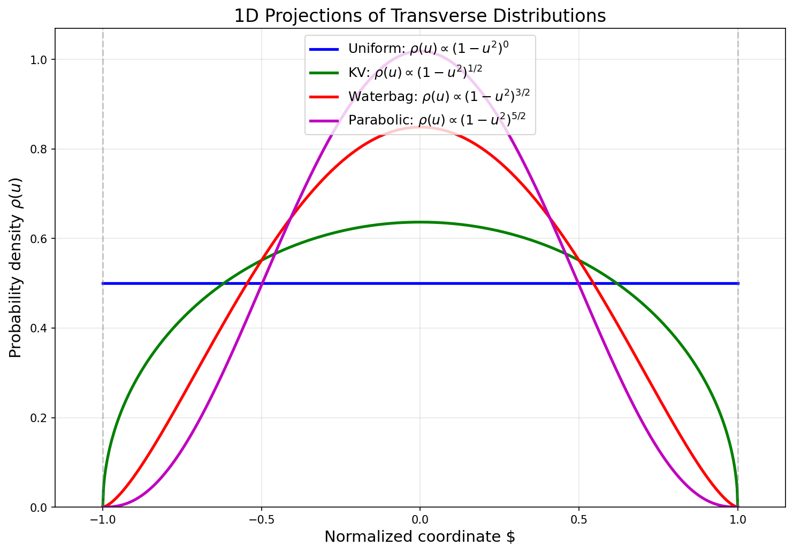

注入\粒子生成（Injection）
==============================

本模块介绍 PASS 中的注入命令 **Injection** ，用于在模拟起始位置生成特定粒子分布并注入束流。注入命令支持为每个束团独立设置横向分布、纵向分布、束流参数、偏移等，是粒子模拟的入口环节。

本示例演示如何构建特定粒子分布。本文件中所使用输入文件及运行代码见 `GitHub 示例代码 <https://github.com/changmx/PASS/tree/master/example/01_generate_distribution>`_ 。

**代码位置**

- 源文件： ``PASS/commands/injection.py``
- 类名： ``Injection`` （继承自 ``Command`` ）
- 注册名： ``injection``
- 辅助类： ``InjectionBunchInfo`` （同文件，负责单个束团的参数解析与分布生成）

接口参数
--------

``Injection`` 命令的参数如下表所示。其中 ``s`` 必须为 0 （注入点固定在序列起始位置）， ``name`` 由序列键名自动填入， ``bunch0`` 、 ``bunch1`` 、 ... 为各束团的参数字典。

.. list-table::
  :header-rows: 1
  :widths: 20 25 10 10 35

  * - 属性名
    - JSON key
    - 类型
    - 单位
    - 说明
  * - ``s``
    - ``S (m)``
    - float
    - m
    - 注入位置 （必须为 0）
  * - ``name``
    - ``name``
    - str
    - -
    - 元件名称，由序列键名自动填入
  * - ``bunch0``
    - ``bunch0``
    - dict
    - -
    - 第 0 个束团的参数字典
  * - ``bunch1``
    - ``bunch1``
    - dict
    - -
    - 第 1 个束团的参数字典
  * - ...
    - ...
    - dict
    - -
    - 更多数量的束团参数字典

束团参数
--------

每个束团以 ``bunch0`` 、 ``bunch1`` 、 ... 为键，值为包含该束团全部参数的字典。参数按横向、纵向、束流、分布、偏移五组分类说明如下。

横向参数
~~~~~~~~~~

.. list-table::
  :header-rows: 1
  :widths: 20 35 10 10 25

  * - 属性名
    - JSON key
    - 类型
    - 单位
    - 说明
  * - ``alphax``
    - ``Alpha x``
    - float
    - -
    - 水平 Twiss 参数 :math:`\alpha_x`
  * - ``alphay``
    - ``Alpha y``
    - float
    - -
    - 垂直 Twiss 参数 :math:`\alpha_y`
  * - ``betax``
    - ``Beta x (m)``
    - float
    - m
    - 水平 Twiss 参数 :math:`\beta_x`
  * - ``betay``
    - ``Beta y (m)``
    - float
    - m
    - 垂直 Twiss 参数 :math:`\beta_y`
  * - ``emitx``
    - ``Emittance x (m'rad)``
    - float
    - m·rad
    - 水平发射度 :math:`\varepsilon_x`
  * - ``emity``
    - ``Emittance y (m'rad)``
    - float
    - m·rad
    - 垂直发射度 :math:`\varepsilon_y`
  * - ``dx``
    - ``Dx (m)``
    - float
    - m
    - 水平色散函数 :math:`D_x`
  * - ``dpx``
    - ``Dpx``
    - float
    - -
    - 水平色散导数 :math:`D_{px}`
  * - ``dist_trans``
    - ``Transverse dist``
    - str
    - -
    - 横向分布类型，可选： ``gaussian`` 、 ``kv`` 、 ``waterbag`` 、 ``parabolic`` 、 ``uniform``

纵向参数
~~~~~~~~~~

.. list-table::
  :header-rows: 1
  :widths: 20 45 10 10 15

  * - 属性名
    - JSON key
    - 类型
    - 单位
    - 说明
  * - ``sigmaz``
    - ``Sigma z (m)``
    - float
    - m
    - 纵向束长 RMS 值 :math:`\sigma_z`
  * - ``dp``
    - ``Sigma dp/p``
    - float
    - -
    - 动量分散 RMS 值 :math:`\sigma_{\delta}`
  * - ``dist_longi``
    - ``Longitudinal dist``
    - str
    - -
    - 纵向分布类型，可选： ``gaussian`` 、 ``coasting`` 、 ``matchz`` 、 ``matchdp``
  * - ``rf_voltage``
    - ``RF Voltage (V)``
    - float
    - V
    - 高频电压 （ ``matchz`` 和 ``matchdp`` 分布需提供）
  * - ``rf_phi``
    - ``RF Phase (rad)``
    - float
    - rad
    - 高频相位 :math:`\phi_s` （ ``matchz`` 和 ``matchdp`` 分布需提供）
  * - ``harmonic_num``
    - ``Harmonic Number``
    - int
    - -
    - 高频谐波数 （ ``matchz`` 和 ``matchdp`` 分布需提供）
  * - ``harmonic_id``
    - ``Harmonic ID of this bunch``
    - int
    - -
    - 该束团所属的高频谐波 ID （从 0 开始），用于多束团注入时将各束团放置到不同的 RF bucket
  * - ``rf_position``
    - ``RF S Position Refer to Inj. Point (m)``
    - float
    - m
    - 高频腔相对于注入点的纵向位置，用于将 s\_rf 处生成的分布逆向传播到 s=0 注入点
  * - ``ddp``
    - ``Momentum Offset dp``
    - float
    - -
    - 束团级平均动量偏差 :math:`\delta_0` ，叠加到每个粒子的 dp 上。与 ``dde`` 互斥
  * - ``dde``
    - ``Kinetic Energy Offset (eV)``
    - float
    - eV
    - 束团级动能偏差，内部转化为 ``ddp`` 。与 ``ddp`` 互斥

束流参数
~~~~~~~~~~

.. list-table::
  :header-rows: 1
  :widths: 25 45 10 10 10

  * - 属性名
    - JSON key
    - 类型
    - 单位
    - 说明
  * - ``Ek``
    - ``Kinetic Energy per Nucleon (eV/u)``
    - float
    - eV/u
    - 每核子动能
  * - -
    - ``Number of Real Particles``
    - float
    - -
    - 真实粒子数
  * - -
    - ``Number of Macro Particles``
    - float
    - -
    - 宏粒子数
  * - ``stop_turn``
    - ``Total Injection Turns``
    - int
    - -
    - 总注入圈数
  * - ``interval``
    - ``Injection Interval``
    - int
    - -
    - 注入间隔 （每 ``interval`` 圈注入一次）

分布参数
~~~~~~~~~~

.. list-table::
  :header-rows: 1
  :widths: 25 45 10 20

  * - 属性名
    - JSON key
    - 类型
    - 说明
  * - ``is_load_dist``
    - ``Is Load Distribution from File``
    - bool
    - 是否从文件加载粒子分布
  * - ``load_dist_filepath``
    - ``Distribution File Path``
    - str
    - 分布文件路径 （ ``.tfs`` 格式）
  * - ``is_save_init_dist``
    - ``Is Save Initial Distribution``
    - bool
    - 是否保存初始分布
  * - ``insert_particles``
    - ``Insert Particle Coordinate``
    - list
    - 插入指定粒子坐标，格式为 ``[[x, px, y, py, z, dp], ...]``

偏移参数
~~~~~~~~~~

水平偏移 （ ``Offset x`` ）和垂直偏移 （ ``Offset y`` ）结构相同，各包含以下子参数：

.. list-table::
  :header-rows: 1
  :widths: 25 30 10 35

  * - 属性名
    - JSON key
    - 类型
    - 说明
  * - ``is_offset``
    - ``Is Offset``
    - bool
    - 是否启用偏移
  * - ``is_offset_fromfile``
    - ``Is Load From File``
    - bool
    - 是否从文件加载偏移数据
  * - -
    - ``File Path``
    - str
    - 偏移数据文件路径 （ ``.tfs`` 格式）
  * - -
    - ``File Time Kind``
    - str
    - 时间列类型，可选： ``turn`` 、 ``time``
  * - ``offset_position``
    - ``Offset Position (m)``
    - float
    - 位置偏移量
  * - ``offset_momentum``
    - ``Offset Momentum (rad)``
    - float
    - 动量偏移量

粒子分布类型简介
----------------

在 PASS 程序中初始粒子分布由 **Injection** 命令实现，在 **Injection** 命令中，可以单独为每个束团设置不同的分布信息。

横向粒子分布
------------

目前 PASS 程序支持生成的横向粒子分布有 **水平垂直解耦的 2D 高斯分布** 、 **4D KV分布** 、 **4D 水袋分布** 、 **4D 抛物线分布** 、 **2D 相空间均匀分布** 。

其中 4D 分布是指在 4D 相空间 :math:`(x, p_x, y, p_y)` 中定义一个广义的超椭球边界。为了简化推导且不失一般性，我们引入 **归一化坐标** ：

.. math::

  X = \frac{x}{a}, \quad P_x = \frac{p_x}{b}, \quad Y = \frac{y}{c}, \quad P_y = \frac{p_y}{d}

其中 :math:`a, b, c, d` 分别是束流在对应维度上的 **最大物理包络边界（硬边界）** 。在此归一化坐标系下，4D 超椭球边界简化为单位超球：

.. math::

  r^2 = X^2 + P_x^2 + Y^2 + P_y^2 \le 1

下面详细介绍各横向粒子分布。对于 4D 分布，其在 1D 平面的投影具有统一的幂函数形式。设 4D 相空间中分布密度为 :math:`f(r^2) \propto (1-r^2)^{\alpha}` （ `\alpha \ge 0` ，定义在 4D 单位球 :math:`B^4` 内），则对任意单一归一化坐标 :math:`u` 的 1D 边缘分布为：

.. math::

  \rho(u) \propto (1-u^2)^{\frac{n-1}{2}+\alpha}, \quad |u| \le 1

其中 :math:`n=4` 为相空间维数。对于均匀分布在 :math:`n` 维球面 :math:`S^{n-1}` 上的分布（如 KV），其 1D 投影为：

.. math::

  \rho(u) \propto (1-u^2)^{\frac{n-3}{2}}

各分布的 1D 投影汇总如下：

.. list-table::
  :header-rows: 1
  :widths: 25 20 15 15 25

  * - 分布
    - 4D密度
    - :math:`\alpha`
    - 1D投影幂次
    - 1D投影形式
  * - Uniform（2D方块）
    - —
    - —
    - 0
    - :math:`\rho(u) = \mathrm{const}`
  * - KV（ :math:`S^3` 球面）
    - :math:`\delta(r-1)`
    - —
    - :math:`\frac{1}{2}`
    - :math:`\rho(u) \propto \sqrt{1-u^2}`
  * - Waterbag（ :math:`B^4` 均匀）
    - :math:`1`
    - 0
    - :math:`\frac{3}{2}`
    - :math:`\rho(u) \propto (1-u^2)^{3/2}`
  * - Parabolic（ :math:`B^4` , :math:`1-r^2` ）
    - :math:`(1-r^2)^1`
    - 1
    - :math:`\frac{5}{2}`
    - :math:`\rho(u) \propto (1-u^2)^{5/2}`

下面详细介绍各横向粒子分布：

  - **独立2D高斯分布（Gaussian）**

    在 :math:`x-p_x` 与 :math:`y-p_y` 相空间中分别独立生成服从高斯分布的横向坐标。粒子在横向相空间中的分布采用 :math:`4\sigma` 截断，即仅保留满足：

    .. math::

       |x| \le 4\sigma_x, \quad |y| \le 4\sigma_y

    的粒子。

    对于二维相空间高斯分布 （ :math:`x-p_x` 与 :math:`y-p_y` ），不同 RMS 发射度对应的粒子包含比例如下：

    +------------------------------------------+------------------------+---------------+
    | :math:`\epsilon/\epsilon_{\mathrm{rms}}` | 截断范围               | 保留粒子比例  |
    +==========================================+========================+===============+
    | 1                                        | :math:`1\sigma`        | 39.346934029% |
    +------------------------------------------+------------------------+---------------+
    | 2                                        | :math:`\sqrt{2}\sigma` | 63.212055883% |
    +------------------------------------------+------------------------+---------------+
    | 4                                        | :math:`2\sigma`        | 86.466471676% |
    +------------------------------------------+------------------------+---------------+
    | 6                                        | :math:`\sqrt{6}\sigma` | 95.021293163% |
    +------------------------------------------+------------------------+---------------+
    | 9                                        | :math:`3\sigma`        | 98.889100346% |
    +------------------------------------------+------------------------+---------------+
    | 16                                       | :math:`4\sigma`        | 99.966453737% |
    +------------------------------------------+------------------------+---------------+

    因此在 :math:`4\sigma` 截断条件下，粒子损失比例极低 （约 :math:`3.3\times10^{-4}` ），可近似认为完整覆盖高斯尾部。

    具体截断比例可通过下面的函数进行计算：

    .. code-block:: python

        import numpy as np

        def fraction_by_emittance(epsilon, epsilon_rms):
            fraction = 1 - np.exp(-epsilon / (2 * epsilon_rms))
            print(f"eps/eps_rms = {epsilon/epsilon_rms}, particle proportion = {fraction:.9%}")

        for epsi in (1, 2, 4, 6, 8, 9, 16, 25, 36):
            fraction_by_emittance(epsilon=epsi, epsilon_rms=1)

  - **4D KV（Kapchinskij-Vladimirskij）分布**

    在 :math:`x-p_x-y-p_y` 四维相空间中生成 **均匀分布在四维超椭球表面上** 的粒子分布，是一种只存在于四维球壳上的理想化分布。这种分布下粒子产生的空间电荷场在束团内部是严格线性的，可以实现空间电荷问题的严格解析求解。

    积分掉两个维度后，KV 分布在任意 2D 平面 （如 :math:`x-p_x` 平面） 上的投影是一个均匀填充的椭圆。进一步积分掉一个维度后，KV 分布在 1D 平面的投影是一个半椭圆 （或半圆） 分布。具体推导如下：KV 分布均匀分布在 4D 超球面 :math:`S^3` 上（ :math:`r^2 = 1` ），对 :math:`u_x` 求 1D 边缘分布需在 :math:`S^3` 上对其余三个坐标积分：

    .. math::

       \rho(u_x) \propto (1-u_x^2)^{\frac{n-3}{2}} = (1-u_x^2)^{\frac{1}{2}}

    即 1D 投影幂次为 :math:`\frac{1}{2}` 。

    .. note::
      
      根据积分可得：在 :math:`x-p_x` 与 :math:`y-p_y` 相平面上KV分布的全发射度为RMS发射度的4倍。
      
    即 KV 分布下所有粒子均处在 :math:`2\sigma` 截断范围内。但是在程序中依然设置为保留满足：

    .. math::

       |x| \le 4\sigma_x, \quad |y| \le 4\sigma_y

    的粒子。

  - **4D 水袋（Waterbag）分布**

    在 :math:`x-p_x-y-p_y` 四维相空间中生成 **均匀分布在四维超椭球内部** 的粒子分布。

    积分掉两个维度后，水袋分布在任意 2D 平面 （如 :math:`x-p_x` 平面） 上的投影呈抛物线分布。进一步积分掉一个维度后，水袋分布在 1D 平面的投影是一个 :math:`\frac{3}{2}` 次幂抛物线型分布。具体推导如下：水袋分布均匀分布在 4D 超球 :math:`B^4` 内（ :math:`f(r^2) = 1` ，即 :math:`\alpha = 0` ），对 :math:`u_x` 求 1D 边缘分布需在 :math:`B^4` 上对其余三个坐标积分，剩余部分为半径 :math:`\sqrt{1-u_x^2}` 的 3D 球：

    .. math::

       \rho(u_x) \propto V_3\!\left(\sqrt{1-u_x^2}\right) \propto (1-u_x^2)^{\frac{3}{2}}

    其中 :math:`V_3(R) \propto R^3` 为 3D 球体积。即 1D 投影幂次为 :math:`\frac{3}{2}` 。
    
    .. note::
      
      根据积分可得：在 :math:`x-p_x` 与 :math:`y-p_y` 相平面上水袋分布的全发射度为RMS发射度的6倍。
      
    即水袋分布下所有粒子均处在 :math:`\sqrt{6}\sigma` 截断范围内。但是在程序中依然设置为保留满足：

    .. math::

       |x| \le 4\sigma_x, \quad |y| \le 4\sigma_y

    的粒子。

  - **4D 抛物线（Parabolic）分布**

    在 :math:`x-p_x-y-p_y` 四维相空间中生成 **密度从中心向外围随着r的增加呈抛物线递减** 的粒子分布，这种分布比水袋分布更贴近真实加速器中偏向中心聚集的束流。

    积分掉两个维度后，抛物线分布在任意 2D 平面 （如 :math:`x-p_x` 平面） 上的投影呈平方抛物线分布。进一步积分掉一个维度后，抛物线分布在 1D 平面的投影是一个 :math:`\frac{5}{2}` 次幂抛物线型分布。具体推导如下：抛物线分布的 4D 密度为 :math:`f(r^2) \propto (1-r^2)^1` （ :math:`\alpha = 1` ），对 :math:`u_x` 求 1D 边缘分布：

    .. math::

       \rho(u_x) \propto (1-u_x^2)^{\frac{n-1}{2}+\alpha} = (1-u_x^2)^{\frac{3}{2}+1} = (1-u_x^2)^{\frac{5}{2}}

    即 1D 投影幂次为 :math:`\frac{5}{2}` 。
    
    .. note::
      
      根据积分可得：在 :math:`x-p_x` 与 :math:`y-p_y` 相平面上抛物线分布的全发射度为RMS发射度的8倍。
      
    即抛物线分布下所有粒子均处在 :math:`\sqrt{8}\sigma` 截断范围内。但是在程序中依然设置为保留满足：

    .. math::

       |x| \le 4\sigma_x, \quad |y| \le 4\sigma_y

    的粒子。

  - **Uniform（均匀分布）**

    在 :math:`x-p_x` 与 :math:`y-p_y` 相空间中分别独立生成 2D 均匀方块分布。对于每个横向平面，在归一化坐标 :math:`(u, v)` 中于 :math:`[-1, 1] \times [-1, 1]` 方块区域内均匀采样，再通过 Twiss 参数映射到物理坐标。该分布的 RMS 发射度严格等于输入参数 :math:`\varepsilon` ，全发射度为 RMS 发射度的 3 倍，所有粒子均处在 :math:`\sqrt{3}\sigma` 截断范围内。这种分布可以模拟电子枪等产生的初始束流。

    积分掉一个维度后，均匀分布在 1D 平面的投影是一个常数（均匀）分布。由于 :math:`u_x` 和 :math:`v_x` 独立均匀分布在 :math:`[-1, 1]` 上，对 :math:`v_x` 积分后：

    .. math::

       \rho(u_x) = \frac{1}{2} = \mathrm{const} \propto (1-u_x^2)^{0}

    即 1D 投影幂次为 :math:`0` 。

纵向粒子分布
------------

目前 PASS 程序支持生成的纵向粒子分布有 **2D高斯分布** 、 **漂移束分布** 、 **匹配高频参数-纵向束长RMS值的分布** 、 **匹配高频参数-动量分散RMS值的分布** ：

  - **2D高斯分布（Gaussian）**

    在 :math:`z-p_z` 相空间中分别生成服从高斯分布的纵向坐标。粒子在纵向相空间中的分布采用 :math:`4\sigma` 截断，即仅保留满足：

    .. math::

      |z| \le 4\sigma_z

    的粒子。

  - **漂移束分布（Coasting）**

    在 :math:`z-p_z` 相空间中生成 :math:`z` 服从均匀分布， :math:`p_z` 服从高斯分布的纵向坐标。粒子在纵向相空间不做截断，纵向位置坐标最大为周长的一半，最小为负周长的一半。

  - **匹配高频参数-纵向束长RMS值的分布（MatchZ）**

    在 :math:`z-p_z` 相空间中生成同时满足高频参数及纵向束长限制 （ :math:`\sigma_z` ） 的纵向坐标。粒子在纵向相空间中的分布采用 :math:`2\sigma` 截断，即仅保留满足：

    .. math::

       |z| \le 2\sigma_z

    的粒子。

  - **匹配高频参数-动量分散RMS值的分布（MatchDp）**

    在 :math:`z-p_z` 相空间中生成同时满足高频参数及动量分散限制 （ :math:`\sigma_{\delta}` ） 的纵向坐标。粒子在纵向相空间中的分布采用 :math:`2\sigma` 截断，即仅保留满足：

    .. math::

       |z| \le 2\sigma_z

    的粒子。

多束团纵向偏移
~~~~~~~~~~~~~~

当注入多个束团时，各束团需要放置到不同的 RF bucket 中。PASS 采用对称偏移公式，在纵向分布生成后自动执行以下三步操作：

.. math::

  z_{\text{final}} = \mathrm{fold}\left( z_{\text{gen}} + \Delta z_{\text{shift}} + \eta \, s_{\text{rf}} \, \delta \right), \quad z \in [-C/2, C/2)

其中：

  1. **对称偏移** ： :math:`\Delta z_{\text{shift}} = \frac{C}{h}\left(h_{\text{id}} - \frac{h}{2} + 0.5\right)` ，使各 bucket 关于 :math:`z=0` 对称分布，偶数 :math:`h` 时没有 bucket 落在 :math:`C/2` 折叠边界上
  2. **rf\_position 逆向传播** ： :math:`\eta \, s_{\text{rf}} \, \delta` ，将在高频腔位置 :math:`s=s_{\text{rf}}` 生成的分布逆向传播到注入点 :math:`s=0` ，其中 :math:`\eta = 1/\gamma_t^2 - 1/\gamma^2` 为滑相因子
  3. **z 折叠** ：将 :math:`z` 折叠到 :math:`[-C/2, C/2)` 区间

同时，偶数 :math:`h` 时 RF 腔在计算粒子相位时自动施加 :math:`C/(2h)` 补偿，以抵消对称偏移引入的等效 :math:`180^\circ` 相位翻转。奇数 :math:`h` 不需要补偿。

束团填充方案
~~~~~~~~~~~~~~

.. note::

   束团 ID （ ``bunch_id`` ）严格按照从 0 开始、步长 1 递增的顺序编号，由输入文件中 ``bunch0`` 、 ``bunch1`` 、 ... 的键名决定。束团数量由输入文件中 ``bunch`` 键的数量决定。

   每个束团的谐波 ID （ ``harmonic_id`` ）可以独立设置，不需要连续，也不需要从 0 开始。谐波 ID 决定了该束团被放置到哪个 RF bucket。

   - **均匀填充** ：当 ``harmonic_id = 0, 1, ... , h-1`` 时，各束团均匀分布在 :math:`h` 个 bucket 中，位置关于 :math:`z=0` 对称（从负到正）
   - **部分填充** ：可以只填充部分 bucket。例如 :math:`h=4` 时只注入 2 个束团，设置 ``harmonic_id = 0`` 和 ``harmonic_id = 2`` ，则只有第 0 和第 2 个 bucket 被填充
   - **任意填充** ： ``harmonic_id`` 可以是 :math:`0` 到 :math:`h-1` 之间的任意整数，支持任意填充方案

下图为环形布局下的束团填充示例。圆环代表加速器周长 :math:`C` ，圆环上的标记点为各 bucket 中心位置。 :math:`z=0` 处为理想粒子位置（注入点）。束团编号和谐波 ID 按顺时针方向递增。上图为 :math:`h=4` （偶数）均匀填充，4 个 bucket 全部填充；下图为 :math:`h=5` （奇数）部分填充，仅填充 bucket 0 和 bucket 2：

.. raw:: html

  

  <svg width="400" height="420" xmlns="http://www.w3.org/2000/svg">
    <rect width="400" height="420" fill="#1a1a2e"/>

    <text x="200" y="25" fill="#e0e0e0" font-size="15" font-weight="bold" text-anchor="middle" font-family="sans-serif">h=4 (even): uniform filling</text>

    <!-- Ring -->
    <circle cx="200" cy="220" r="140" fill="none" stroke="#555" stroke-width="2"/>

    <!-- Bucket boundary lines (every C/4 = 90 deg) -->
    <line x1="200" y1="220" x2="340" y2="220" stroke="#444" stroke-width="1" stroke-dasharray="4,3"/>
    <line x1="200" y1="220" x2="200" y2="80" stroke="#444" stroke-width="1" stroke-dasharray="4,3"/>
    <line x1="200" y1="220" x2="60" y2="220" stroke="#444" stroke-width="1" stroke-dasharray="4,3"/>
    <line x1="200" y1="220" x2="200" y2="360" stroke="#444" stroke-width="1" stroke-dasharray="4,3"/>

    <!-- hid=0: z=-3C/8, clockwise from z=0(right) => lower-left -->
    <!-- angle from right = -135deg (clockwise 135deg) => x=200+140*cos(-135)=200-99=101, y=220+140*sin(-135)... 
         Actually clockwise from right: z=0 at angle 0, clockwise positive.
         z=-3C/8 => fraction -3/8 of C => angle = -3/8*2pi = -135deg => same as 225deg
         In SVG (y down): clockwise = increasing angle in screen coords
         z=0 at (340,220). Clockwise (downward first):
         z=-C/8 => 45deg clockwise => (200+140cos45, 220+140sin45) = (299, 319)
         z=-3C/8 => 135deg clockwise => (200+140cos135, 220+140sin135) = (101, 319)
         z=C/8 => -45deg (counterclockwise, upward) => (299, 121)
         z=3C/8 => -135deg => (101, 121)
         Wait, clockwise in SVG means y increases (downward).
         z=0 at right (340,220). Clockwise 45deg goes to lower-right (299,319).
         But z=-C/8 is negative z, which should be "behind" the ideal particle.
         
         Let me think again: z = s - beta0*c*t. Positive z means particle is ahead (larger s).
         If we go clockwise on the ring and call that positive z direction,
         then z>0 is clockwise from z=0, z<0 is counterclockwise.
         
         User wants bucket IDs clockwise. hid=0 has most negative z (-3C/8 for h=4).
         So hid=0 is far counterclockwise (upper-left), hid=3 is far clockwise (lower-right)?
         No wait - user said "束团编号和谐波id应该是顺时针的" meaning IDs increase clockwise.
         hid=0 -> hid=1 -> hid=2 -> hid=3 goes clockwise.
         hid=0: z=-3C/8, hid=1: z=-C/8, hid=2: z=C/8, hid=3: z=3C/8
         So z increases clockwise. z=0 is between hid=1 and hid=2.
         
         Positions (clockwise from top, z=0 at right=3 o'clock):
         z=0 at 3 o'clock (340, 220)
         Clockwise = downward in SVG
         z=-3C/8 at 135deg CCW from right = 10:30 position => upper-left
         z=-C/8 at 45deg CCW from right = 1:30 position => upper-right  
         z=C/8 at 45deg CW from right = 4:30 position => lower-right
         z=3C/8 at 135deg CW from right = 7:30 position => lower-left
         
         But that makes IDs go CCW: hid=0(upper-left)->hid=1(upper-right)->hid=2(lower-right)->hid=3(lower-left)
         That's clockwise! upper-left -> upper-right -> lower-right -> lower-left IS clockwise.
    -->

    <!-- z=0 ideal particle marker (right side of ring) -->
    <circle cx="340" cy="220" r="6" fill="#00d2ff" stroke="#00d2ff" stroke-width="2"/>
    <text x="352" y="215" fill="#00d2ff" font-size="13" font-weight="bold" font-family="monospace">z=0</text>
    <text x="352" y="232" fill="#00d2ff" font-size="11" font-family="sans-serif">(ideal)</text>

    <!-- hid=0: z=-3C/8, upper-left, angle=225deg in std (or -135deg) -->
    <!-- x=200+140*cos(225deg)=200-99=101, y=220+140*sin(225deg)=220-99=121 -->
    <!-- Wait, in SVG y is down. cos/sin with SVG y-down:
         angle 0 = right, positive angle = clockwise (y increases)
         z=-3C/8: this is 3/8*2pi = 135deg counterclockwise from z=0
         In SVG: counterclockwise = negative angle = y decreases
         x = 200 + 140*cos(-135deg) = 200 + 140*(-0.707) = 101
         y = 220 + 140*sin(-135deg) = 220 + 140*(-0.707) = 121  (upper-left) ✓
    -->
    <circle cx="101" cy="121" r="10" fill="#e94560" stroke="#e94560" stroke-width="2"/>
    <text x="75" y="108" fill="#e94560" font-size="12" text-anchor="middle" font-family="monospace">bucket 0</text>
    <text x="75" y="124" fill="#e94560" font-size="12" text-anchor="middle" font-family="monospace">hid=0</text>
    <text x="75" y="140" fill="#e94560" font-size="12" text-anchor="middle" font-family="monospace">bunch 0</text>
    <text x="68" y="155" fill="#888" font-size="11" text-anchor="middle" font-family="monospace">-3C/8</text>

    <!-- hid=1: z=-C/8, upper-right, angle=-45deg -->
    <!-- x=200+140*cos(-45)=200+99=299, y=220+140*sin(-45)=220-99=121 -->
    <circle cx="299" cy="121" r="10" fill="#e94560" stroke="#e94560" stroke-width="2"/>
    <text x="325" y="108" fill="#e94560" font-size="12" text-anchor="middle" font-family="monospace">bucket 1</text>
    <text x="325" y="124" fill="#e94560" font-size="12" text-anchor="middle" font-family="monospace">hid=1</text>
    <text x="325" y="140" fill="#e94560" font-size="12" text-anchor="middle" font-family="monospace">bunch 1</text>
    <text x="332" y="155" fill="#888" font-size="11" text-anchor="middle" font-family="monospace">-C/8</text>

    <!-- hid=2: z=C/8, lower-right, angle=45deg -->
    <!-- x=200+140*cos(45)=299, y=220+140*sin(45)=220+99=319 -->
    <circle cx="299" cy="319" r="10" fill="#e94560" stroke="#e94560" stroke-width="2"/>
    <text x="325" y="312" fill="#e94560" font-size="12" text-anchor="middle" font-family="monospace">bucket 2</text>
    <text x="325" y="328" fill="#e94560" font-size="12" text-anchor="middle" font-family="monospace">hid=2</text>
    <text x="325" y="344" fill="#e94560" font-size="12" text-anchor="middle" font-family="monospace">bunch 2</text>
    <text x="332" y="360" fill="#888" font-size="11" text-anchor="middle" font-family="monospace">C/8</text>

    <!-- hid=3: z=3C/8, lower-left, angle=135deg -->
    <!-- x=200+140*cos(135)=101, y=220+140*sin(135)=319 -->
    <circle cx="101" cy="319" r="10" fill="#e94560" stroke="#e94560" stroke-width="2"/>
    <text x="75" y="312" fill="#e94560" font-size="12" text-anchor="middle" font-family="monospace">bucket 3</text>
    <text x="75" y="328" fill="#e94560" font-size="12" text-anchor="middle" font-family="monospace">hid=3</text>
    <text x="75" y="344" fill="#e94560" font-size="12" text-anchor="middle" font-family="monospace">bunch 3</text>
    <text x="68" y="360" fill="#888" font-size="11" text-anchor="middle" font-family="monospace">3C/8</text>

    <!-- Legend -->
    <circle cx="60" cy="400" r="7" fill="#e94560" stroke="#e94560" stroke-width="2"/>
    <text x="75" y="404" fill="#888" font-size="12" font-family="sans-serif">Filled bunch</text>
    <circle cx="190" cy="400" r="7" fill="none" stroke="#555" stroke-width="1.5" stroke-dasharray="3,2"/>
    <text x="205" y="404" fill="#888" font-size="12" font-family="sans-serif">Empty bucket</text>
    <circle cx="315" cy="400" r="6" fill="#00d2ff" stroke="#00d2ff" stroke-width="2"/>
    <text x="328" y="404" fill="#888" font-size="12" font-family="sans-serif">Ideal particle</text>
  </svg>
  

.. raw:: html

  

  <svg width="400" height="420" xmlns="http://www.w3.org/2000/svg">
    <rect width="400" height="420" fill="#1a1a2e"/>

    <text x="200" y="25" fill="#e0e0e0" font-size="15" font-weight="bold" text-anchor="middle" font-family="sans-serif">h=5 (odd): partial filling</text>

    <!-- Ring -->
    <circle cx="200" cy="220" r="140" fill="none" stroke="#555" stroke-width="2"/>

    <!-- Bucket boundaries at z = -C/2, -2C/5+..., every C/5 -->
    <!-- z=0 at right (0deg), boundaries at +/-C/10, +/-3C/10, +/-C/2 -->
    <!-- C/10 = 36deg, 3C/10 = 108deg, C/2 = 180deg -->
    <line x1="200" y1="220" x2="340" y2="220" stroke="#444" stroke-width="1" stroke-dasharray="4,3"/>
    <!-- 36deg: x=200+140cos(36)=313, y=220+140sin(36)=302 -->
    <line x1="200" y1="220" x2="313" y2="302" stroke="#444" stroke-width="1" stroke-dasharray="4,3"/>
    <!-- -36deg: x=313, y=138 -->
    <line x1="200" y1="220" x2="313" y2="138" stroke="#444" stroke-width="1" stroke-dasharray="4,3"/>
    <!-- 108deg: x=200+140cos(108)=157, y=220+140sin(108)=353 -->
    <line x1="200" y1="220" x2="157" y2="353" stroke="#444" stroke-width="1" stroke-dasharray="4,3"/>
    <!-- -108deg: x=157, y=87 -->
    <line x1="200" y1="220" x2="157" y2="87" stroke="#444" stroke-width="1" stroke-dasharray="4,3"/>
    <!-- 180deg: x=60, y=220 -->
    <line x1="200" y1="220" x2="60" y2="220" stroke="#444" stroke-width="1" stroke-dasharray="4,3"/>

    <!-- Bucket centers: shift=C/5*(hid-2.5+0.5)=C/5*(hid-2) -->
    <!-- hid=0: z=-2C/5, angle=-144deg (CCW). x=200+140cos(-144)=200-113=87, y=220+140sin(-144)=220-82=138 -->
    <!-- hid=1: z=-C/5, angle=-72deg. x=200+140cos(-72)=200+43=243, y=220+140sin(-72)=220-133=87 -->
    <!-- hid=2: z=0, angle=0. x=340, y=220 -->
    <!-- hid=3: z=C/5, angle=72deg. x=243, y=353 -->
    <!-- hid=4: z=2C/5, angle=144deg. x=87, y=302 -->

    <!-- z=0 ideal particle (hid=2 position, but empty) -->
    <circle cx="340" cy="220" r="6" fill="#00d2ff" stroke="#00d2ff" stroke-width="2"/>
    <text x="352" y="215" fill="#00d2ff" font-size="13" font-weight="bold" font-family="monospace">z=0</text>
    <text x="352" y="232" fill="#00d2ff" font-size="11" font-family="sans-serif">(ideal)</text>

    <!-- hid=0: z=-2C/5, FILLED, bunch_id=0 -->
    <circle cx="87" cy="138" r="10" fill="#00d2ff" stroke="#00d2ff" stroke-width="2"/>
    <text x="55" y="125" fill="#00d2ff" font-size="12" text-anchor="middle" font-family="monospace">bucket 0</text>
    <text x="55" y="141" fill="#00d2ff" font-size="12" text-anchor="middle" font-family="monospace">hid=0</text>
    <text x="55" y="157" fill="#00d2ff" font-size="12" text-anchor="middle" font-family="monospace">bunch 0</text>
    <text x="48" y="172" fill="#888" font-size="11" text-anchor="middle" font-family="monospace">-2C/5</text>

    <!-- hid=1: z=-C/5, EMPTY -->
    <circle cx="243" cy="87" r="10" fill="none" stroke="#555" stroke-width="1.5" stroke-dasharray="3,2"/>
    <text x="243" y="68" fill="#666" font-size="12" text-anchor="middle" font-family="monospace">bucket 1</text>
    <text x="243" y="54" fill="#666" font-size="12" text-anchor="middle" font-family="monospace">hid=1</text>
    <text x="275" y="92" fill="#555" font-size="11" font-family="monospace">(empty)</text>
    <text x="278" y="106" fill="#888" font-size="11" font-family="monospace">-C/5</text>

    <!-- hid=2: z=0, FILLED, bunch_id=1 -->
    <circle cx="340" cy="220" r="10" fill="#00d2ff" stroke="#00d2ff" stroke-width="2"/>
    <text x="375" y="250" fill="#00d2ff" font-size="12" text-anchor="middle" font-family="monospace">bucket 2</text>
    <text x="375" y="266" fill="#00d2ff" font-size="12" text-anchor="middle" font-family="monospace">hid=2</text>
    <text x="375" y="282" fill="#00d2ff" font-size="12" text-anchor="middle" font-family="monospace">bunch 1</text>

    <!-- hid=3: z=C/5, EMPTY -->
    <circle cx="243" cy="353" r="10" fill="none" stroke="#555" stroke-width="1.5" stroke-dasharray="3,2"/>
    <text x="243" y="378" fill="#666" font-size="12" text-anchor="middle" font-family="monospace">bucket 3</text>
    <text x="243" y="394" fill="#666" font-size="12" text-anchor="middle" font-family="monospace">hid=3</text>
    <text x="278" y="348" fill="#555" font-size="11" font-family="monospace">(empty)</text>
    <text x="278" y="362" fill="#888" font-size="11" font-family="monospace">C/5</text>

    <!-- hid=4: z=2C/5, EMPTY -->
    <circle cx="87" cy="302" r="10" fill="none" stroke="#555" stroke-width="1.5" stroke-dasharray="3,2"/>
    <text x="55" y="295" fill="#666" font-size="12" text-anchor="middle" font-family="monospace">bucket 4</text>
    <text x="55" y="311" fill="#666" font-size="12" text-anchor="middle" font-family="monospace">hid=4</text>
    <text x="48" y="327" fill="#555" font-size="11" text-anchor="middle" font-family="monospace">(empty)</text>
    <text x="48" y="341" fill="#888" font-size="11" text-anchor="middle" font-family="monospace">2C/5</text>

    <!-- Legend -->
    <circle cx="60" cy="400" r="7" fill="#00d2ff" stroke="#00d2ff" stroke-width="2"/>
    <text x="75" y="404" fill="#888" font-size="12" font-family="sans-serif">Filled bunch</text>
    <circle cx="190" cy="400" r="7" fill="none" stroke="#555" stroke-width="1.5" stroke-dasharray="3,2"/>
    <text x="205" y="404" fill="#888" font-size="12" font-family="sans-serif">Empty bucket</text>
    <circle cx="315" cy="400" r="6" fill="#00d2ff" stroke="#00d2ff" stroke-width="2"/>
    <text x="328" y="404" fill="#888" font-size="12" font-family="sans-serif">Ideal particle</text>
  </svg>
  

色散耦合
~~~~~~~~

如果注入点存在色散函数 :math:`D_x` 和 :math:`D_{px}` ，则在生成横向分布后自动施加色散耦合：

.. math::

  x \leftarrow x + D_x \cdot \delta, \quad p_x \leftarrow p_x + D_{px} \cdot \delta

其中 :math:`\delta` 为粒子的动量偏差。这确保了粒子分布与纵向动量分散在物理上自洽。

动量偏差
~~~~~~~~

注入时可以为整个束团施加平均动量偏移 :math:`\delta_0` 。粒子分布生成时 :math:`\delta` 服从均值为 0 的分布（如高斯分布 :math:`\delta \sim \mathcal{N}(0, \sigma_\delta)` ），施加偏移后变为 :math:`\delta \sim \mathcal{N}(\delta_0, \sigma_\delta)` ，即分布中心从 0 平移到 :math:`\delta_0` 。:math:`\delta_0` 是叠加量，不是粒子的总 :math:`\delta` 。这用于模拟注入能量偏移、参考动量偏移等场景。

支持两种输入方式（互斥，若同时为非零值则报错）：

  - **动量偏差** （ ``Momentum Offset dp`` ）：直接给出 :math:`\delta_0` （无量纲，相对于参考动量的偏差）
  - **动能偏差** （ ``Kinetic Energy Offset (eV)`` ）：给出 :math:`\Delta E` （单位 eV），内部转化为 :math:`\delta_0`

**精确转换公式**

动能偏差 :math:`\Delta E` 到动量偏差 :math:`\delta_0` 的转换，采用精确的相对论能量-动量关系：

.. math::

  E^2 = p^2 + m_0^2

其中 :math:`E` 为总能量（ :math:`E = E_k + m_0` ）， :math:`p` 为动量， :math:`m_0` 为静止质量。参考粒子（无偏差）的参数为：

.. math::

  E_0 = E_k + m_0, \quad p_0 = \sqrt{E_0^2 - m_0^2}

施加动能偏差 :math:`\Delta E` 后，粒子总能量变为 :math:`E_1 = E_0 + \Delta E` ，对应动量为：

.. math::

  p_1 = \sqrt{E_1^2 - m_0^2} = \sqrt{(E_0 + \Delta E)^2 - m_0^2}

因此动量偏差为：

.. math::

  \delta_0 = \frac{p_1}{p_0} - 1 = \frac{\sqrt{(E_0 + \Delta E)^2 - m_0^2}}{\sqrt{E_0^2 - m_0^2}} - 1

此公式 **完全精确** ，无任何近似，与 RF 腔中采用的精确 :math:`E^2 = p^2 + m_0^2` 变换保持一致。

**一阶线性化近似**

对式 :math:`\delta_0 = p_1/p_0 - 1` 在 :math:`\Delta E \to 0` 处做一阶泰勒展开。由 :math:`E \, dE = p \, dp` 得：

.. math::

  dE = \frac{p}{E} \, dp = \beta \, dp \quad \Longrightarrow \quad dp = \frac{dE}{\beta}

其中 :math:`\beta = p_0 c / E_0` 为参考粒子速度。由于 PASS 中 :math:`\delta = \Delta p / p_0` 为相对动量偏差，参考动量 :math:`p_0 = \beta \gamma m_0 = \beta E_0` ，故：

.. math::

  \delta_0 \approx \frac{\Delta E}{\beta^2 \, E_0}

此近似截断了 :math:`O(\delta_0^2)` 及更高阶项。在小偏差时精度足够，但大偏差时误差显著。

**精确与近似对比**

下表以质子（ :math:`E_k = 45` MeV ， :math:`\beta = 0.299` ）为例，展示不同 :math:`\Delta E` 下两种公式的差异：

.. list-table::
  :header-rows: 1
  :widths: 20 25 25 20

  * - :math:`\Delta E` (eV)
    - 精确 :math:`\delta_0`
    - 近似 :math:`\delta_0`
    - 相对误差
  * - 1,000
    - 1.137126e-5
    - 1.137132e-5
    - 0.000005%
  * - 10,000
    - 1.137073e-4
    - 1.137132e-4
    - 0.000052%
  * - 100,000
    - 1.136544e-3
    - 1.137132e-3
    - 0.000517%
  * - 1,000,000
    - 1.131311e-2
    - 1.137132e-2
    - 0.0514%
  * - 10,000,000
    - 1.084146e-1
    - 1.137132e-1
    - 4.89%
  * - 50,000,000
    - 4.717485e-1
    - 5.685659e-1
    - 20.5%

在小偏差（ :math:`\Delta E < 100` keV ）时两种公式几乎无差异，但在大偏差（如 :math:`\Delta E > 1` MeV ）时线性近似误差超过 0.05%，在 :math:`\Delta E = 50` MeV 时误差高达 20%。PASS 采用精确公式以覆盖大偏差场景。

**施加顺序**

动量偏差 :math:`\delta_0` 在纵向偏移之前施加到每个粒子的 :math:`\delta` 上：

.. math::

  \delta \leftarrow \delta + \delta_0

因此后续的 rf\_position 逆向传播（ :math:`z \leftarrow z + \eta \, s_{\text{rf}} \, \delta` ）和色散耦合（ :math:`x \leftarrow x + D_x \, \delta` ）均使用包含 :math:`\delta_0` 的 :math:`\delta` 值，确保物理自洽。

输入文件
--------

.. code-block:: json

  {
      "Beam Name": "proton",
      "Number of Protons": 1,
      "Number of Neutrons": 0,
      "Number of Charges": 1,
      "Transition Gamma": 4.8,
      "Number of turns": 5,
      "Circumference (m)": 251.327,
      "Backend (gpu/cpu)":"cpu",
      "Number of GPU devices": 1,
      "Device Id": [
          0
      ],
      "Output directory": "./output",
      "Is plot figure": true,
      "Sequence": {
          "Injection": {
              "S (m)": 0.0,
              "Command": "Injection",
              "bunch0": {
                  "Kinetic Energy per Nucleon (eV/u)": 45e6,
                  "Number of Real Particles": 100000000000.0,
                  "Number of Macro Particles": 100000.0,
                  "Is Load Distribution from File": false,
                  "Distribution File Path": "",
                  "Total Injection Turns": 1,
                  "Injection Interval": 1,
                  "Alpha x": -2.614303952,
                  "Alpha y": 1.57442348,
                  "Beta x (m)": 0.5,
                  "Beta y (m)": 0.5,
                  "Emittance x (m'rad)": 0.00019999999999999998,
                  "Emittance y (m'rad)": 9.999999999999999e-05,
                  "Dx (m)": 0.0,
                  "Dpx": 0.0,
                  "Sigma z (m)": 30,
                  "Sigma dp/p": 0.005,
                  "Transverse dist": "gaussian",
                  "Longitudinal dist": "matchz",
                  "RF Voltage (V)": 100e3,
                  "RF Phase (rad)": 0.5235987755982988,
                  "Harmonic Number": 1,
                  "Harmonic ID of this bunch": 0,
                  "RF S Position Refer to Inj. Point (m)": 0.0,
                  "Offset x": {
                      "Is Offset": false,
                      "Is Load From File": false,
                      "File Path": "",
                      "File Time Kind": "turn",
                      "Offset Position (m)": 0.0,
                      "Offset Momentum (rad)": 0.0
                  },
                  "Offset y": {
                      "Is Offset": false,
                      "Is Load From File": false,
                      "File Path": "",
                      "File Time Kind": "turn",
                      "Offset Position (m)": 0.0,
                      "Offset Momentum (rad)": 0.0
                  },
                  "Is Save Initial Distribution": true,
                  "Insert Particle Coordinate": [[0,0,0,0,0,0]]
              }
          },
          "StatMonitor1":{
              "S (m)": 0.0,
              "Command": "StatMonitor"
          }
      }
  }

运行命令
--------

.. code-block:: bash

  cd PASS\example\01_generate_distribution
  python run.py --beam0=./beam0.json

根据上面的输入文件，将生成在横向满足 Gaussian 分布，在纵向满足 MatchZ 分布的束团。修改下面这两行参数，可调整生成的束团分布类型：

.. code-block:: json

  "Transverse dist": "gaussian",
  "Longitudinal dist": "matchz",

其中横向分布的 value 有： ``gaussian`` 、 ``kv`` 、 ``waterbag`` 、 ``parabolic`` 、 ``uniform`` ，纵向分布的 value 有： ``gaussian`` 、 ``coasting`` 、 ``matchz`` 、 ``matchdp`` 。

在生成纵向 gaussian 与 coasting 分布时，不需要高频相关参数，在生成 matchz 与 matchdp 分布时，需要提供高频参数。

1D 投影理论曲线
------------------

下图展示了四种横向分布（ Uniform 、 KV 、 Waterbag 、 Parabolic ）在 1D 平面的理论投影曲线。所有曲线均归一化至 :math:`\int_{-1}^{1} \rho(u) \, du = 1` ，横轴为归一化坐标 :math:`u \in [-1, 1]` 。可以清晰看到从 Uniform （平顶）到 Parabolic （尖峰）的幂次递增趋势。

  Figure 1. 1D projections of transverse distributions (theory)

模拟结果
--------

下面将展示保持上述输入文件中 Twiss、发射度、高频等参数不变，只改变分布类型时，模拟所得粒子分布图片。

- 横向 Gaussian 分布：

.. figure:: images_injection/ex_beam0_bunch0_100000_hor_gaussian_longi_matchz_Dx_0.0_injection_x-px.png
  :alt: Gaussian x-px
  :width: 100%
  :align: center

  Figure 2. Transverse gaussian distribution: x-px

.. figure:: images_injection/ex_beam0_bunch0_100000_hor_gaussian_longi_matchz_Dx_0.0_injection_y-py.png
  :alt: Gaussian y-py
  :width: 100%
  :align: center

  Figure 3. Transverse gaussian distribution: y-py

.. figure:: images_injection/ex_beam0_bunch0_100000_hor_gaussian_longi_matchz_Dx_0.0_injection_x-y.png
  :alt: Gaussian x-y
  :width: 100%
  :align: center

  Figure 4. Transverse gaussian distribution: x-y

- 横向 KV 分布：

.. figure:: images_injection/ex_beam0_bunch0_100000_hor_kv_longi_matchz_Dx_0.0_injection_x-px.png
  :alt: kv x-px
  :width: 100%
  :align: center

  Figure 5. Transverse KV distribution: x-px

.. figure:: images_injection/ex_beam0_bunch0_100000_hor_kv_longi_matchz_Dx_0.0_injection_y-py.png
  :alt: kv y-py
  :width: 100%
  :align: center

  Figure 6. Transverse KV distribution: y-py

.. figure:: images_injection/ex_beam0_bunch0_100000_hor_kv_longi_matchz_Dx_0.0_injection_x-y.png
  :alt: kv x-y
  :width: 100%
  :align: center

  Figure 7. Transverse KV distribution: x-y

- 横向水袋分布：

.. figure:: images_injection/ex_beam0_bunch0_100000_hor_waterbag_longi_matchz_Dx_0.0_injection_x-px.png
  :alt: waterbag x-px
  :width: 100%
  :align: center

  Figure 8. Transverse waterbag distribution: x-px

.. figure:: images_injection/ex_beam0_bunch0_100000_hor_waterbag_longi_matchz_Dx_0.0_injection_y-py.png
  :alt: waterbag y-py
  :width: 100%
  :align: center

  Figure 9. Transverse waterbag distribution: y-py

.. figure:: images_injection/ex_beam0_bunch0_100000_hor_waterbag_longi_matchz_Dx_0.0_injection_x-y.png
  :alt: waterbag x-y
  :width: 100%
  :align: center

  Figure 10. Transverse waterbag distribution: x-y

- 横向抛物线分布：

.. figure:: images_injection/ex_beam0_bunch0_100000_hor_parabolic_longi_matchz_Dx_0.0_injection_x-px.png
  :alt: parabolic x-px
  :width: 100%
  :align: center

  Figure 11. Transverse parabolic distribution: x-px

.. figure:: images_injection/ex_beam0_bunch0_100000_hor_parabolic_longi_matchz_Dx_0.0_injection_y-py.png
  :alt: parabolic y-py
  :width: 100%
  :align: center

  Figure 12. Transverse parabolic distribution: y-py

.. figure:: images_injection/ex_beam0_bunch0_100000_hor_parabolic_longi_matchz_Dx_0.0_injection_x-y.png
  :alt: parabolic x-y
  :width: 100%
  :align: center

  Figure 13. Transverse parabolic distribution: x-y

- 横向均匀分布：

.. figure:: images_injection/ex_beam0_bunch0_100000_hor_uniform_longi_matchz_Dx_0.0_injection_x-px.png
  :alt: uniform x-px
  :width: 100%
  :align: center

  Figure 14. Transverse uniform distribution: x-px

.. figure:: images_injection/ex_beam0_bunch0_100000_hor_uniform_longi_matchz_Dx_0.0_injection_y-py.png
  :alt: uniform y-py
  :width: 100%
  :align: center

  Figure 15. Transverse uniform distribution: y-py

.. figure:: images_injection/ex_beam0_bunch0_100000_hor_uniform_longi_matchz_Dx_0.0_injection_x-y.png
  :alt: uniform x-y
  :width: 100%
  :align: center

  Figure 16. Transverse uniform distribution: x-y

- 纵向 MatchZ 分布：

.. figure:: images_injection/ex_beam0_bunch0_100000_hor_gaussian_longi_matchz_Dx_0.0_injection_z-pz.png
  :alt: MatchZ z-pz
  :width: 100%
  :align: center

  Figure 17. Longitudinal matchz distribution: z-pz

- 纵向 MatchDp 分布：

.. figure:: images_injection/ex_beam0_bunch0_100000_hor_gaussian_longi_matchdp_Dx_0.0_injection_z-pz.png
  :alt: MatchDp z-pz
  :width: 100%
  :align: center

  Figure 18. Longitudinal matchdp distribution: z-pz

- 纵向 Gaussian 分布：

.. figure:: images_injection/ex_beam0_bunch0_100000_hor_gaussian_longi_gaussian_Dx_0.0_injection_z-pz.png
  :alt: Gaussian z-pz
  :width: 100%
  :align: center

  Figure 19. Longitudinal gaussian distribution: z-pz

- 纵向 Coasting 分布：

.. figure:: images_injection/ex_beam0_bunch0_100000_hor_gaussian_longi_coasting_Dx_0.0_injection_z-pz.png
  :alt: coasting z-pz
  :width: 100%
  :align: center

  Figure 20. Longitudinal coasting distribution: z-pz
