注入模块（Injection）
========================

本模块介绍 PASS 中的注入命令 **Injection** ，用于在模拟起始位置生成特定粒子分布并注入束流。注入命令支持为每个束团独立设置横向分布、纵向分布、束流参数、偏移等，是粒子模拟的入口环节。

本示例演示如何构建特定粒子分布。本文件中所使用输入文件及运行代码见 `GitHub 示例代码 <https://github.com/changmx/PASS/tree/master/example/01_generate_distribution>`_ 。

**代码位置**

- 源文件： ``PASS/commands/injection.py``
- 类名： ``Injection`` （继承自 ``Command`` ）
- 注册名： ``injection``
- 辅助类： ``InjectionBunchInfo`` （同文件，负责单个束团的参数解析与分布生成）

接口参数
--------

``Injection`` 命令的参数如下表所示。其中 ``s`` 必须为 0 （注入点固定在序列起始位置）， ``name`` 由序列键名自动填入， ``bunch0`` 、 ``bunch1`` 、 ... 为各束团的参数字典。

.. list-table::
  :header-rows: 1
  :widths: 20 25 10 10 35

  * - 属性名
    - JSON key
    - 类型
    - 单位
    - 说明
  * - ``s``
    - ``S (m)``
    - float
    - m
    - 注入位置 （必须为 0）
  * - ``name``
    - ``name``
    - str
    - -
    - 元件名称，由序列键名自动填入
  * - ``bunch0``
    - ``bunch0``
    - dict
    - -
    - 第 0 个束团的参数字典
  * - ``bunch1``
    - ``bunch1``
    - dict
    - -
    - 第 1 个束团的参数字典
  * - ...
    - ...
    - dict
    - -
    - 更多数量的束团参数字典

束团参数
--------

每个束团以 ``bunch0`` 、 ``bunch1`` 、 ... 为键，值为包含该束团全部参数的字典。参数按横向、纵向、束流、分布、偏移五组分类说明如下。

横向参数
~~~~~~~~~~

.. list-table::
  :header-rows: 1
  :widths: 20 35 10 10 25

  * - 属性名
    - JSON key
    - 类型
    - 单位
    - 说明
  * - ``alphax``
    - ``Alpha x``
    - float
    - -
    - 水平 Twiss 参数 :math:`\alpha_x`
  * - ``alphay``
    - ``Alpha y``
    - float
    - -
    - 垂直 Twiss 参数 :math:`\alpha_y`
  * - ``betax``
    - ``Beta x (m)``
    - float
    - m
    - 水平 Twiss 参数 :math:`\beta_x`
  * - ``betay``
    - ``Beta y (m)``
    - float
    - m
    - 垂直 Twiss 参数 :math:`\beta_y`
  * - ``emitx``
    - ``Emittance x (m'rad)``
    - float
    - m·rad
    - 水平发射度 :math:`\varepsilon_x`
  * - ``emity``
    - ``Emittance y (m'rad)``
    - float
    - m·rad
    - 垂直发射度 :math:`\varepsilon_y`
  * - ``dx``
    - ``Dx (m)``
    - float
    - m
    - 水平色散函数 :math:`D_x`
  * - ``dpx``
    - ``Dpx``
    - float
    - -
    - 水平色散导数 :math:`D_{px}`
  * - ``dist_trans``
    - ``Transverse dist``
    - str
    - -
    - 横向分布类型，可选： ``gaussian`` 、 ``kv`` 、 ``waterbag`` 、 ``parabolic`` 、 ``uniform``

纵向参数
~~~~~~~~~~

.. list-table::
  :header-rows: 1
  :widths: 20 45 10 10 15

  * - 属性名
    - JSON key
    - 类型
    - 单位
    - 说明
  * - ``sigmaz``
    - ``Sigma z (m)``
    - float
    - m
    - 纵向束长 RMS 值 :math:`\sigma_z`
  * - ``dp``
    - ``Sigma dp/p``
    - float
    - -
    - 动量分散 RMS 值 :math:`\sigma_{\delta}`
  * - ``dist_longi``
    - ``Longitudinal dist``
    - str
    - -
    - 纵向分布类型，可选： ``gaussian`` 、 ``coasting`` 、 ``matchz`` 、 ``matchdp``
  * - ``rf_voltage``
    - ``RF Voltage (V)``
    - float
    - V
    - 高频电压 （ ``matchz`` 和 ``matchdp`` 分布需提供）
  * - ``rf_phi``
    - ``RF Phase (rad)``
    - float
    - rad
    - 高频相位 :math:`\phi_s` （ ``matchz`` 和 ``matchdp`` 分布需提供）
  * - ``harmonic_num``
    - ``Harmonic Number``
    - int
    - -
    - 高频谐波数 （ ``matchz`` 和 ``matchdp`` 分布需提供）
  * - ``harmonic_id``
    - ``Harmonic ID of this bunch``
    - int
    - -
    - 该束团所属的高频谐波 ID
  * - ``rf_position``
    - ``RF S Position Refer to Inj. Point (m)``
    - float
    - m
    - 高频腔相对于注入点的纵向位置

束流参数
~~~~~~~~~~

.. list-table::
  :header-rows: 1
  :widths: 25 45 10 10 10

  * - 属性名
    - JSON key
    - 类型
    - 单位
    - 说明
  * - ``Ek``
    - ``Kinetic Energy per Nucleon (eV/u)``
    - float
    - eV/u
    - 每核子动能
  * - -
    - ``Number of Real Particles``
    - float
    - -
    - 真实粒子数
  * - -
    - ``Number of Macro Particles``
    - float
    - -
    - 宏粒子数
  * - ``stop_turn``
    - ``Total Injection Turns``
    - int
    - -
    - 总注入圈数
  * - ``interval``
    - ``Injection Interval``
    - int
    - -
    - 注入间隔 （每 ``interval`` 圈注入一次）

分布参数
~~~~~~~~~~

.. list-table::
  :header-rows: 1
  :widths: 25 45 10 20

  * - 属性名
    - JSON key
    - 类型
    - 说明
  * - ``is_load_dist``
    - ``Is Load Distribution from File``
    - bool
    - 是否从文件加载粒子分布
  * - ``load_dist_filepath``
    - ``Distribution File Path``
    - str
    - 分布文件路径 （ ``.tfs`` 格式）
  * - ``is_save_init_dist``
    - ``Is Save Initial Distribution``
    - bool
    - 是否保存初始分布
  * - ``insert_particles``
    - ``Insert Particle Coordinate``
    - list
    - 插入指定粒子坐标，格式为 ``[[x, px, y, py, z, dp], ...]``

偏移参数
~~~~~~~~~~

水平偏移 （ ``Offset x`` ）和垂直偏移 （ ``Offset y`` ）结构相同，各包含以下子参数：

.. list-table::
  :header-rows: 1
  :widths: 25 30 10 35

  * - 属性名
    - JSON key
    - 类型
    - 说明
  * - ``is_offset``
    - ``Is Offset``
    - bool
    - 是否启用偏移
  * - ``is_offset_fromfile``
    - ``Is Load From File``
    - bool
    - 是否从文件加载偏移数据
  * - -
    - ``File Path``
    - str
    - 偏移数据文件路径 （ ``.tfs`` 格式）
  * - -
    - ``File Time Kind``
    - str
    - 时间列类型，可选： ``turn`` 、 ``time``
  * - ``offset_position``
    - ``Offset Position (m)``
    - float
    - 位置偏移量
  * - ``offset_momentum``
    - ``Offset Momentum (rad)``
    - float
    - 动量偏移量

粒子分布类型简介
----------------

在 PASS 程序中初始粒子分布由 **Injection** 命令实现，在 **Injection** 命令中，可以单独为每个束团设置不同的分布信息。

横向粒子分布
------------

目前 PASS 程序支持生成的横向粒子分布有 **水平垂直解耦的 2D 高斯分布** 、 **4D KV分布** 、 **4D 水袋分布** 、 **4D 双曲线分布** 、 **2D X-Y 均匀分布** 。

其中 4D 分布是指在 4D 相空间 :math:`(x, p_x, y, p_y)` 中定义一个广义的超椭球边界。为了简化推导且不失一般性，我们引入 **归一化坐标** ：

.. math::

  X = \frac{x}{a}, \quad P_x = \frac{p_x}{b}, \quad Y = \frac{y}{c}, \quad P_y = \frac{p_y}{d}

其中 :math:`a, b, c, d` 分别是束流在对应维度上的 **最大物理包络边界（硬边界）** 。在此归一化坐标系下，4D 超椭球边界简化为单位超球：

.. math::

  r^2 = X^2 + P_x^2 + Y^2 + P_y^2 \le 1

下面详细介绍各横向粒子分布：

  - **独立2D高斯分布（Gaussian）**

    在 :math:`x-p_x` 与 :math:`y-p_y` 相空间中分别独立生成服从高斯分布的横向坐标。粒子在横向相空间中的分布采用 :math:`4\sigma` 截断，即仅保留满足：

    .. math::

       |x| \le 4\sigma_x, \quad |y| \le 4\sigma_y

    的粒子。

    对于二维相空间高斯分布 （ :math:`x-p_x` 与 :math:`y-p_y` ），不同 RMS 发射度对应的粒子包含比例如下：

    +------------------------------------------+------------------------+---------------+
    | :math:`\epsilon/\epsilon_{\mathrm{rms}}` | 截断范围               | 保留粒子比例  |
    +==========================================+========================+===============+
    | 1                                        | :math:`1\sigma`        | 39.346934029% |
    +------------------------------------------+------------------------+---------------+
    | 2                                        | :math:`\sqrt{2}\sigma` | 63.212055883% |
    +------------------------------------------+------------------------+---------------+
    | 4                                        | :math:`2\sigma`        | 86.466471676% |
    +------------------------------------------+------------------------+---------------+
    | 6                                        | :math:`\sqrt{6}\sigma` | 95.021293163% |
    +------------------------------------------+------------------------+---------------+
    | 9                                        | :math:`3\sigma`        | 98.889100346% |
    +------------------------------------------+------------------------+---------------+
    | 16                                       | :math:`4\sigma`        | 99.966453737% |
    +------------------------------------------+------------------------+---------------+

    因此在 :math:`4\sigma` 截断条件下，粒子损失比例极低 （约 :math:`3.3\times10^{-4}` ），可近似认为完整覆盖高斯尾部。

    具体截断比例可通过下面的函数进行计算：

    .. code-block:: python

        import numpy as np

        def fraction_by_emittance(epsilon, epsilon_rms):
            fraction = 1 - np.exp(-epsilon / (2 * epsilon_rms))
            print(f"eps/eps_rms = {epsilon/epsilon_rms}, particle proportion = {fraction:.9%}")

        for epsi in (1, 2, 4, 6, 8, 9, 16, 25, 36):
            fraction_by_emittance(epsilon=epsi, epsilon_rms=1)

  - **4D KV（Kapchinskij-Vladimirskij）分布**

    在 :math:`x-p_x-y-p_y` 四维相空间中生成 **均匀分布在四维超椭球表面上** 的粒子分布，是一种只存在于四维球壳上的理想化分布。这种分布下粒子产生的空间电荷场在束团内部是严格线性的，可以实现空间电荷问题的严格解析求解。

    积分掉两个维度后，KV 分布在任意 2D 平面 （如 :math:`x-p_x` 平面） 上的投影是一个均匀填充的椭圆。进一步积分掉一个维度后，KV 分布在 1D 平面的投影是一个半椭圆 （或半圆） 分布。
    根据积分可得：在 :math:`x-p_x` 与 :math:`y-p_y` 相平面上 **KV分布的全发射度为RMS发射度的4倍** ，即 KV 分布下所有粒子均处在 :math:`2\sigma` 截断范围内。但是在程序中依然设置为保留满足：

    .. math::

       |x| \le 4\sigma_x, \quad |y| \le 4\sigma_y

    的粒子。

  - **4D 水袋（Waterbag）分布**

    在 :math:`x-p_x-y-p_y` 四维相空间中生成 **均匀分布在四维超椭球内部** 的粒子分布。

    积分掉两个维度后，水袋分布在任意 2D 平面 （如 :math:`x-p_x` 平面） 上的投影呈抛物线分布。进一步积分掉一个维度后，水袋分布在 1D 平面的投影是一个3/2次幂抛物线型分布。
    根据积分可得：在 :math:`x-p_x` 与 :math:`y-p_y` 相平面上 **水袋分布的全发射度为RMS发射度的6倍** ，即水袋分布下所有粒子均处在 :math:`\sqrt{6}\sigma` 截断范围内。但是在程序中依然设置为保留满足：

    .. math::

       |x| \le 4\sigma_x, \quad |y| \le 4\sigma_y

    的粒子。

  - **4D 抛物线（Parabolic）分布**

    在 :math:`x-p_x-y-p_y` 四维相空间中生成 **密度从中心向外围随着r的增加呈抛物线递减** 的粒子分布，这种分布比水袋分布更贴近真实加速器中偏向中心聚集的束流。

    积分掉两个维度后，抛物线分布在任意 2D 平面 （如 :math:`x-p_x` 平面） 上的投影呈平方抛物线分布。进一步积分掉一个维度后，抛物线分布在 1D 平面的投影是一个5/2次幂抛物线型分布。
    根据积分可得：在 :math:`x-p_x` 与 :math:`y-p_y` 相平面上 **抛物线分布的全发射度为RMS发射度的8倍** ，即抛物线分布下所有粒子均处在 :math:`\sqrt{8}\sigma` 截断范围内。但是在程序中依然设置为保留满足：

    .. math::

       |x| \le 4\sigma_x, \quad |y| \le 4\sigma_y

    的粒子。

  - **Uniform（均匀分布）**

    在 :math:`x-y` 平面生成在 :math:`\pm 4\sigma` 范围内均匀的粒子，在 :math:`x-p_x` 与 :math:`y-p_y` 相空间中分别独立服从高斯分布。这种分布可以模拟电子枪等产生的初始束流。

纵向粒子分布
------------

目前 PASS 程序支持生成的纵向粒子分布有 **2D高斯分布** 、 **漂移束分布** 、 **匹配高频参数-纵向束长RMS值的分布** 、 **匹配高频参数-动量分散RMS值的分布** ：

  - **2D高斯分布（Gaussian）**

    在 :math:`z-p_z` 相空间中分别生成服从高斯分布的纵向坐标。粒子在纵向相空间中的分布采用 :math:`4\sigma` 截断，即仅保留满足：

    .. math::

      |z| \le 4\sigma_z

    的粒子。

  - **漂移束分布（Coasting）**

    在 :math:`z-p_z` 相空间中生成 :math:`z` 服从均匀分布， :math:`p_z` 服从高斯分布的纵向坐标。粒子在纵向相空间不做截断，纵向位置坐标最大为周长的一半，最小为负周长的一半。

  - **匹配高频参数-纵向束长RMS值的分布（MatchZ）**

    在 :math:`z-p_z` 相空间中生成同时满足高频参数及纵向束长限制 （ :math:`\sigma_z` ） 的纵向坐标。粒子在纵向相空间中的分布采用 :math:`2\sigma` 截断，即仅保留满足：

    .. math::

       |z| \le 2\sigma_z

    的粒子。

  - **匹配高频参数-动量分散RMS值的分布（MatchDp）**

    在 :math:`z-p_z` 相空间中生成同时满足高频参数及动量分散限制 （ :math:`\sigma_{\delta}` ） 的纵向坐标。粒子在纵向相空间中的分布采用 :math:`2\sigma` 截断，即仅保留满足：

    .. math::

       |z| \le 2\sigma_z

    的粒子。

输入文件
--------

.. code-block:: json

  {
      "Beam Name": "proton",
      "Number of Protons": 1,
      "Number of Neutrons": 0,
      "Number of Charges": 1,
      "Transition Gamma": 4.8,
      "Number of turns": 5,
      "Circumference (m)": 251.327,
      "Backend (gpu/cpu)":"cpu",
      "Number of GPU devices": 1,
      "Device Id": [
          0
      ],
      "Output directory": "./output",
      "Is plot figure": true,
      "Sequence": {
          "Injection": {
              "S (m)": 0.0,
              "Command": "Injection",
              "bunch0": {
                  "Kinetic Energy per Nucleon (eV/u)": 45e6,
                  "Number of Real Particles": 100000000000.0,
                  "Number of Macro Particles": 100000.0,
                  "Is Load Distribution from File": false,
                  "Distribution File Path": "",
                  "Total Injection Turns": 1,
                  "Injection Interval": 1,
                  "Alpha x": -2.614303952,
                  "Alpha y": 1.57442348,
                  "Beta x (m)": 0.5,
                  "Beta y (m)": 0.5,
                  "Emittance x (m'rad)": 0.00019999999999999998,
                  "Emittance y (m'rad)": 9.999999999999999e-05,
                  "Dx (m)": 0.0,
                  "Dpx": 0.0,
                  "Sigma z (m)": 30,
                  "Sigma dp/p": 0.005,
                  "Transverse dist": "gaussian",
                  "Longitudinal dist": "matchz",
                  "RF Voltage (V)": 100e3,
                  "RF Phase (rad)": 0.5235987755982988,
                  "Harmonic Number": 1,
                  "Harmonic ID of this bunch": 0,
                  "RF S Position Refer to Inj. Point (m)": 0.0,
                  "Offset x": {
                      "Is Offset": false,
                      "Is Load From File": false,
                      "File Path": "",
                      "File Time Kind": "turn",
                      "Offset Position (m)": 0.0,
                      "Offset Momentum (rad)": 0.0
                  },
                  "Offset y": {
                      "Is Offset": false,
                      "Is Load From File": false,
                      "File Path": "",
                      "File Time Kind": "turn",
                      "Offset Position (m)": 0.0,
                      "Offset Momentum (rad)": 0.0
                  },
                  "Is Save Initial Distribution": true,
                  "Insert Particle Coordinate": [[0,0,0,0,0,0]]
              }
          },
          "StatMonitor1":{
              "S (m)": 0.0,
              "Command": "StatMonitor"
          }
      }
  }

运行命令
--------

.. code-block:: bash

  cd PASS\example\01_generate_distribution
  python run.py --beam0=./beam0.json

根据上面的输入文件，将生成在横向满足 Gaussian 分布，在纵向满足 MatchZ 分布的束团。修改下面这两行参数，可调整生成的束团分布类型：

.. code-block:: json

  "Transverse dist": "gaussian",
  "Longitudinal dist": "matchz",

其中横向分布的 value 有： ``gaussian`` 、 ``kv`` 、 ``waterbag`` 、 ``parabolic`` 、 ``uniform`` ，纵向分布的 value 有： ``gaussian`` 、 ``coasting`` 、 ``matchz`` 、 ``matchdp`` 。

在生成纵向 gaussian 与 coasting 分布时，不需要高频相关参数，在生成 matchz 与 matchdp 分布时，需要提供高频参数。

模拟结果
--------

下面将展示保持上述输入文件中 Twiss、发射度、高频等参数不变，只改变分布类型时，模拟所得粒子分布图片。

- 横向 Gaussian 分布：

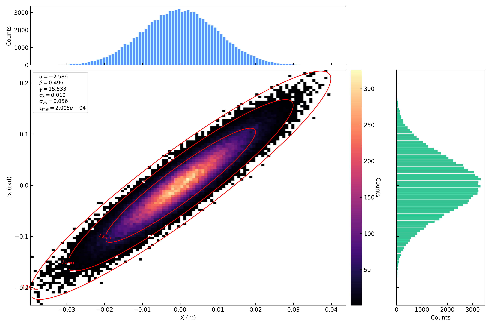

  Figure 1. Transverse gaussian distribution: x-px

.. figure:: images_injection/ex_beam0_bunch0_100000_hor_gaussian_longi_matchz_Dx_0.0_injection_y-py.png
  :alt: Gaussian y-py
  :width: 100%
  :align: center

  Figure 2. Transverse gaussian distribution: y-py

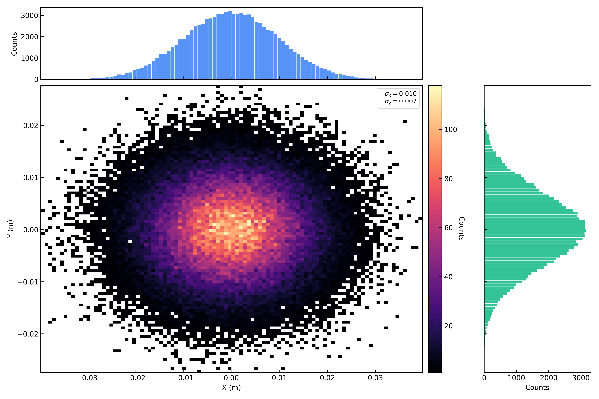

  Figure 3. Transverse gaussian distribution: x-y

- 横向 KV 分布：

.. figure:: images_injection/ex_beam0_bunch0_100000_hor_kv_longi_matchz_Dx_0.0_injection_x-px.png
  :alt: kv x-px
  :width: 100%
  :align: center

  Figure 4. Transverse KV distribution: x-px

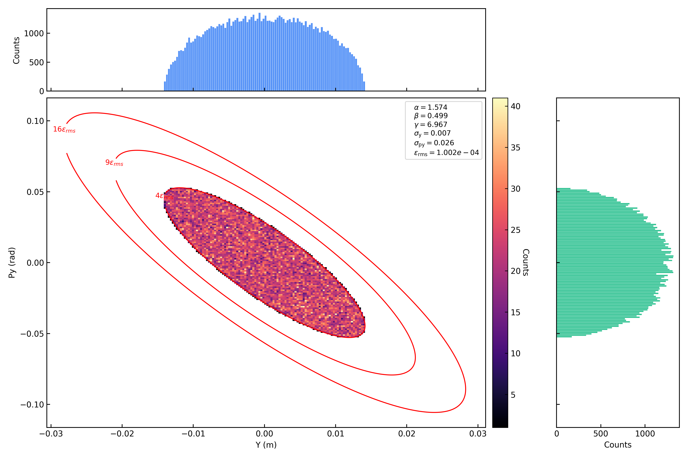

  Figure 5. Transverse KV distribution: y-py

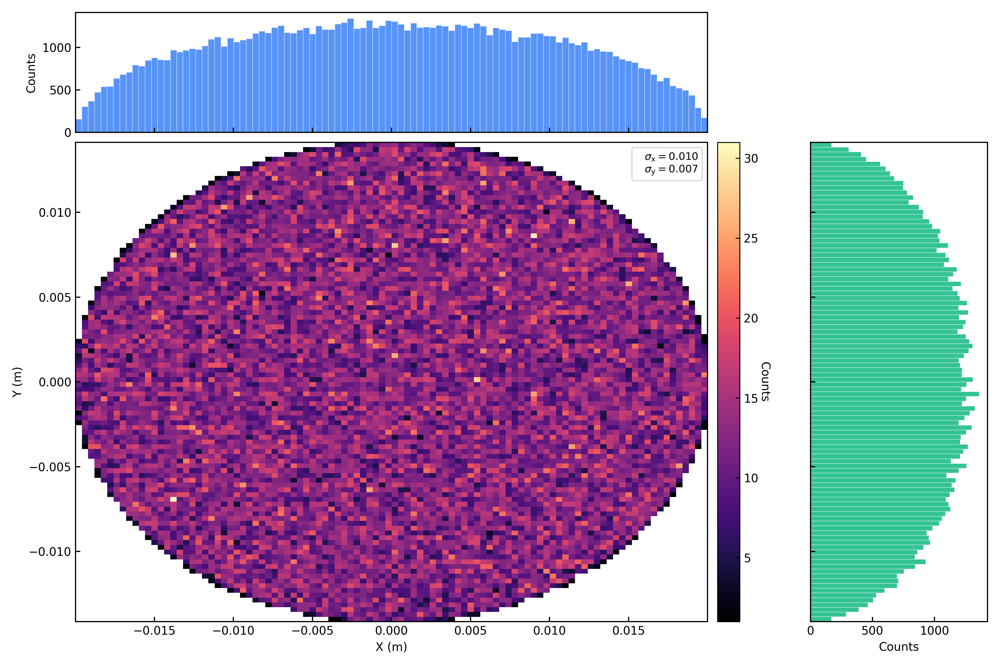

  Figure 6. Transverse KV distribution: x-y

- 横向水袋分布：

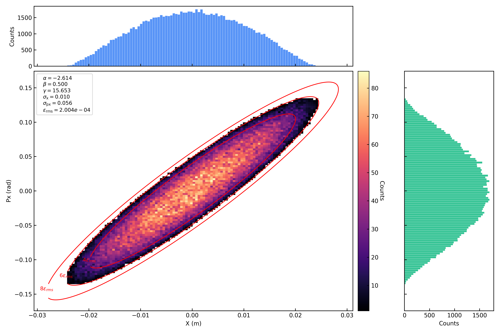

  Figure 7. Transverse waterbag distribution: x-px

.. figure:: images_injection/ex_beam0_bunch0_100000_hor_waterbag_longi_matchz_Dx_0.0_injection_y-py.png
  :alt: waterbag y-py
  :width: 100%
  :align: center

  Figure 8. Transverse waterbag distribution: y-py

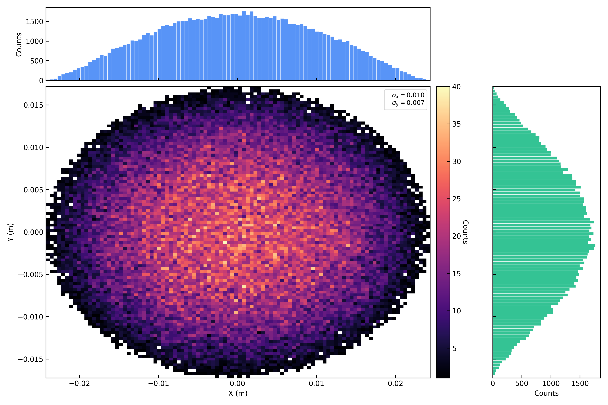

  Figure 9. Transverse waterbag distribution: x-y

- 横向抛物线分布：

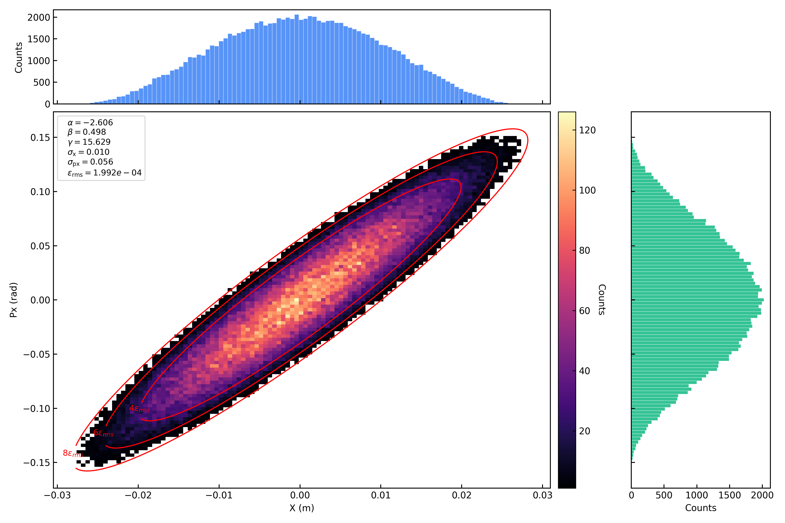

  Figure 10. Transverse parabolic distribution: x-px

.. figure:: images_injection/ex_beam0_bunch0_100000_hor_parabolic_longi_matchz_Dx_0.0_injection_y-py.png
  :alt: parabolic y-py
  :width: 100%
  :align: center

  Figure 11. Transverse parabolic distribution: y-py

.. figure:: images_injection/ex_beam0_bunch0_100000_hor_parabolic_longi_matchz_Dx_0.0_injection_x-y.png
  :alt: parabolic x-y
  :width: 100%
  :align: center

  Figure 12. Transverse parabolic distribution: x-y

- 横向均匀分布：

.. figure:: images_injection/ex_beam0_bunch0_100000_hor_uniform_longi_matchz_Dx_0.0_injection_x-px.png
  :alt: uniform x-px
  :width: 100%
  :align: center

  Figure 13. Transverse uniform distribution: x-px

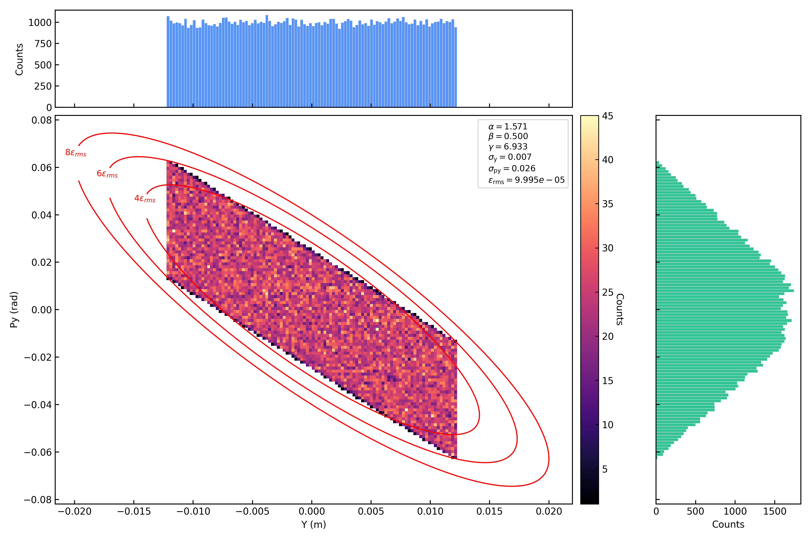

  Figure 14. Transverse uniform distribution: y-py

.. figure:: images_injection/ex_beam0_bunch0_100000_hor_uniform_longi_matchz_Dx_0.0_injection_x-y.png
  :alt: uniform x-y
  :width: 100%
  :align: center

  Figure 15. Transverse uniform distribution: x-y

- 纵向 MatchZ 分布：

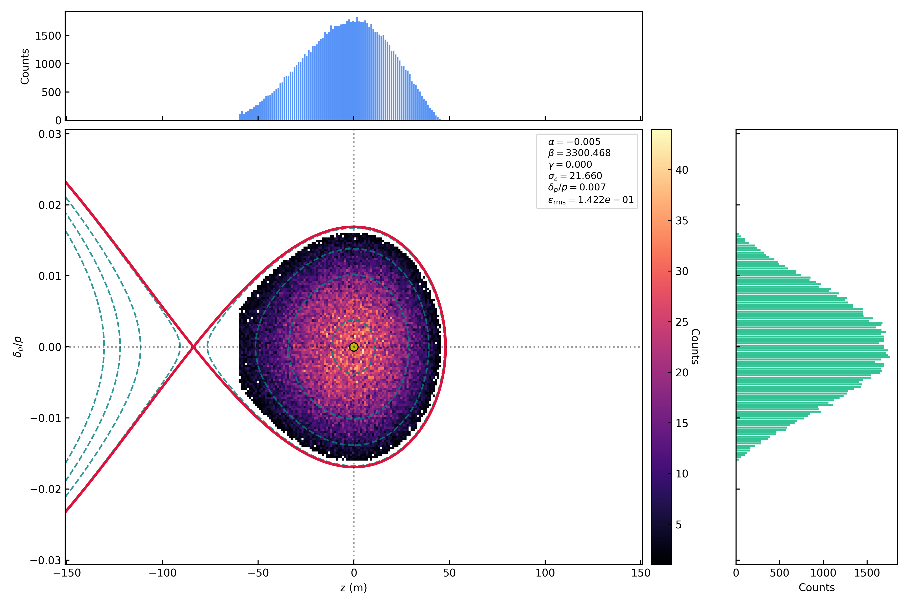

  Figure 16. Longitudinal matchz distribution: z-pz

- 纵向 MatchDp 分布：

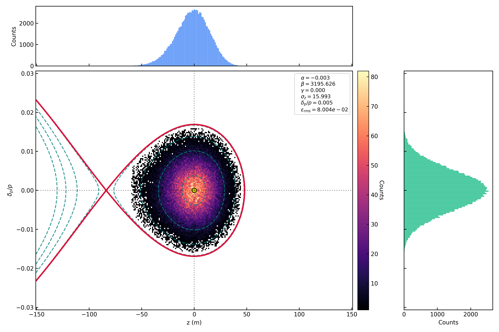

  Figure 17. Longitudinal matchdp distribution: z-pz

- 纵向 Gaussian 分布：

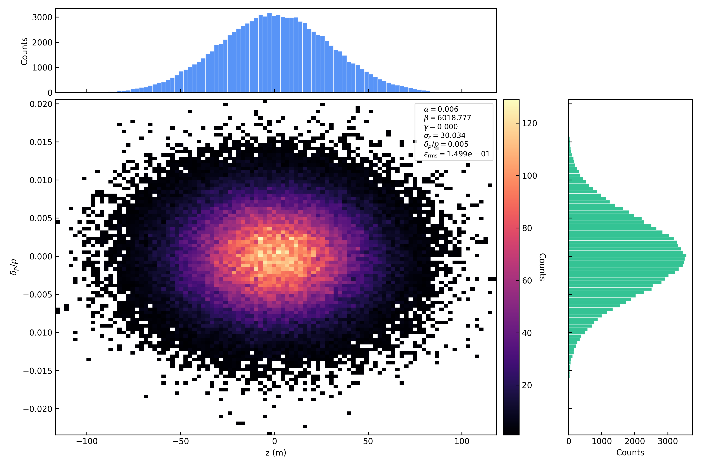

  Figure 18. Longitudinal gaussian distribution: z-pz

- 纵向 Coasting 分布：

.. figure:: images_injection/ex_beam0_bunch0_100000_hor_gaussian_longi_coasting_Dx_0.0_injection_z-pz.png
  :alt: coasting z-pz
  :width: 100%
  :align: center

  Figure 19. Longitudinal coasting distribution: z-pz
